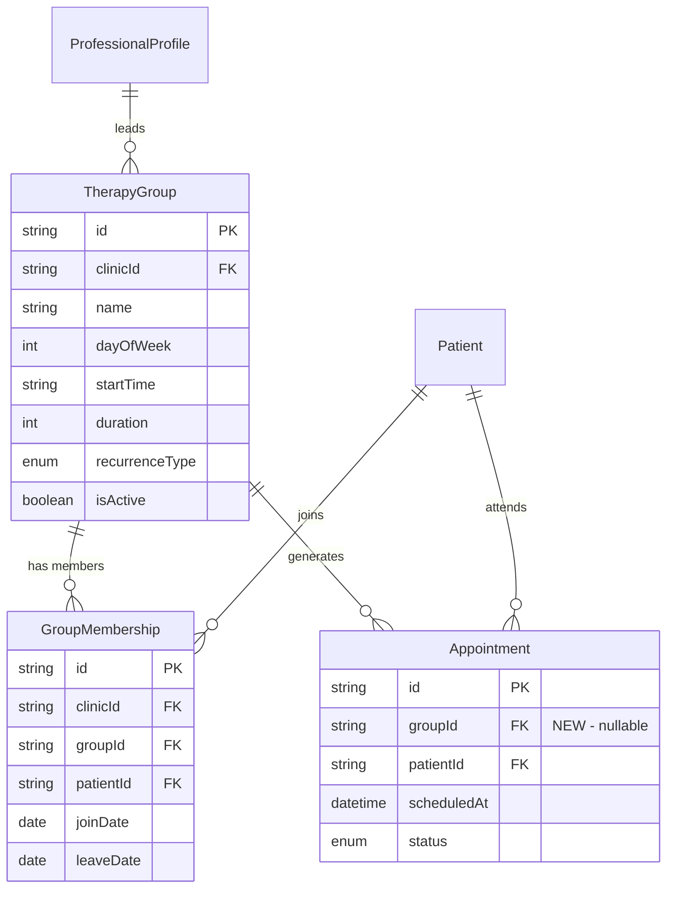

# Group Appointments Feature (Simplified)

## Overview

Add group therapy session support by extending the existing Appointment model with a `groupId` field. Each participant in a group session gets their own Appointment record, preserving all existing status tracking, notifications, and conflict checking.

## Problem Statement

Clinics need to run group therapy sessions where:
- Multiple patients attend the same time slot with one professional
- Each patient's attendance is tracked independently
- Notifications work the same as individual appointments

## Proposed Solution

**2 new tables + 1 field on Appointment**

Instead of 4 new tables with complex relationships, we:
1. Create `TherapyGroup` to define the group and its schedule
2. Create `GroupMembership` to track who belongs to each group
3. Add `groupId` to existing `Appointment` to link group session appointments

This approach:
- Reuses 100% of existing notification infrastructure
- Reuses 100% of existing status tracking
- Reuses existing conflict checking (with minor modification)
- Zero new status enums needed
- ~70% less code than the complex approach

---

## Technical Approach

### Database Schema

```prisma
// prisma/schema.prisma additions

model TherapyGroup {
  id                    String         @id @default(cuid())
  clinicId              String
  professionalProfileId String
  name                  String         // e.g., "Thursday Anxiety Group"
  dayOfWeek             Int            // 0-6 (Sunday-Saturday)
  startTime             String         // e.g., "14:00"
  duration              Int            @default(90)
  recurrenceType        RecurrenceType @default(WEEKLY)
  isActive              Boolean        @default(true)
  createdAt             DateTime       @default(now())
  updatedAt             DateTime       @updatedAt

  clinic              Clinic              @relation(fields: [clinicId], references: [id], onDelete: Cascade)
  professionalProfile ProfessionalProfile @relation(fields: [professionalProfileId], references: [id], onDelete: Cascade)
  memberships         GroupMembership[]
  appointments        Appointment[]

  @@index([clinicId])
  @@index([professionalProfileId])
  @@index([clinicId, isActive])
}

model GroupMembership {
  id        String    @id @default(cuid())
  clinicId  String    // Denormalized for tenant isolation queries
  groupId   String
  patientId String
  joinDate  DateTime  @db.Date
  leaveDate DateTime? @db.Date  // null = active member
  createdAt DateTime  @default(now())
  updatedAt DateTime  @updatedAt

  clinic  Clinic       @relation(fields: [clinicId], references: [id], onDelete: Cascade)
  group   TherapyGroup @relation(fields: [groupId], references: [id], onDelete: Cascade)
  patient Patient      @relation(fields: [patientId], references: [id], onDelete: Cascade)

  @@unique([groupId, patientId, joinDate])
  @@index([clinicId])
  @@index([groupId])
  @@index([patientId])
}

// EXTEND existing Appointment model
model Appointment {
  // ... existing fields unchanged ...

  groupId String?  // NEW: Links appointments in same group session
  group   TherapyGroup? @relation(fields: [groupId], references: [id], onDelete: SetNull)

  @@index([groupId, scheduledAt])  // NEW: Query group sessions
}
```

### ERD Diagram



---

## How It Works

### Creating a Group Session

When a group has a session scheduled:

```typescript
// Generate appointments for all active members
const activeMembers = await prisma.groupMembership.findMany({
  where: {
    groupId,
    joinDate: { lte: sessionDate },
    OR: [{ leaveDate: null }, { leaveDate: { gt: sessionDate } }]
  }
})

// Create one Appointment per member
// Note: Skip conflict check for group sessions - multiple appointments
// at same time with same professional is intentional
await prisma.appointment.createMany({
  data: activeMembers.map(member => ({
    clinicId: group.clinicId,
    professionalProfileId: group.professionalProfileId,
    patientId: member.patientId,
    groupId: group.id,  // Links them together
    scheduledAt: sessionDateTime,
    endAt: addMinutes(sessionDateTime, group.duration),
    status: 'AGENDADO',
    modality: 'PRESENCIAL',
  }))
})
```

### Conflict Checking (CRITICAL)

The existing conflict check prevents double-booking professionals. For group sessions, we need to **exclude appointments in the same group session** from conflict detection.

**Modify `src/lib/appointments/conflict-check.ts`:**

```typescript
export interface ConflictCheckParams {
  professionalProfileId: string
  scheduledAt: Date
  endAt: Date
  excludeAppointmentId?: string
  excludeGroupId?: string  // NEW: Exclude same group session
}

// In the query, add exception for same group session:
const conflicts = await client.$queryRaw<ConflictingAppointment[]>`
  SELECT a.id, a."scheduledAt", a."endAt", p.name as "patientName"
  FROM "Appointment" a
  JOIN "Patient" p ON a."patientId" = p.id
  WHERE a."professionalProfileId" = ${professionalProfileId}
    AND a.status NOT IN ('CANCELADO_PACIENTE', 'CANCELADO_PROFISSIONAL')
    AND a."scheduledAt" < ${endAt}
    AND a."endAt" > ${scheduledAt}
    ${excludeAppointmentId ? Prisma.sql`AND a.id != ${excludeAppointmentId}` : Prisma.empty}
    ${excludeGroupId ? Prisma.sql`AND (a."groupId" IS NULL OR a."groupId" != ${excludeGroupId})` : Prisma.empty}
  LIMIT 1 FOR UPDATE
`
```

**Session generation skips conflict check entirely** - the professional is intentionally booked for all group members at the same time.

### Calendar Display

Query group sessions by finding distinct (groupId, scheduledAt) combinations:

```typescript
// Get group sessions for calendar
const groupSessions = await prisma.appointment.groupBy({
  by: ['groupId', 'scheduledAt'],
  where: {
    clinicId,
    groupId: { not: null },
    scheduledAt: { gte: startDate, lte: endDate }
  },
  _count: { id: true }
})

// Batch fetch group names (avoid N+1)
const groupIds = groupSessions
  .map(gs => gs.groupId)
  .filter((id): id is string => id !== null)

const groups = await prisma.therapyGroup.findMany({
  where: { id: { in: groupIds } },
  select: { id: true, name: true }
})
const groupMap = new Map(groups.map(g => [g.id, g.name]))

// Enrich with group names
const sessions = groupSessions.map(gs => ({
  ...gs,
  groupName: groupMap.get(gs.groupId!) ?? 'Unknown Group',
  participantCount: gs._count.id
}))
```

### Status Tracking

Each participant already has their own Appointment with independent status:
- `AGENDADO` - Scheduled
- `CONFIRMADO` - Confirmed
- `FINALIZADO` - Completed
- `NAO_COMPARECEU` - No-show
- `CANCELADO_PACIENTE` / `CANCELADO_PROFISSIONAL` - Cancelled

**No new enums needed. No new status tracking code needed.**

### Notifications

Existing notification system works unchanged:
- Each Appointment has its own `confirmToken` and `cancelToken`
- Reminder cron job picks up group appointments automatically
- Templates work as-is (patient name, date, time, professional)

### Member Leave Behavior

When a member's `leaveDate` is set:

1. **Future appointments are NOT auto-cancelled** (avoid destructive operations)
2. The admin sees a warning: "Patient has X future sessions scheduled"
3. Admin can manually cancel those appointments if desired
4. New session generation will not include this member for dates after `leaveDate`

This is the safest approach - no automatic data destruction.

### New Member Joining Existing Sessions

When a new member joins a group that already has generated sessions:

1. **New member is NOT auto-added to existing sessions** (simplest approach)
2. Admin can manually add them to specific upcoming sessions via the appointment API
3. Future session generation will include the new member

---

## Implementation Phases

### Phase 1: Core Infrastructure

**Tasks:**
- [x] Create Prisma migration for TherapyGroup and GroupMembership
- [x] Add `groupId` field to Appointment model
- [x] **Modify conflict check** to accept `excludeGroupId` parameter
- [x] Add RBAC resource type `therapy-group`
- [x] Create group CRUD endpoints
- [x] Create membership management endpoints
- [x] Create session generation logic (reuse `calculateRecurrenceDates`)

**Files:**
- `prisma/schema.prisma` - Add models and groupId field
- `prisma/migrations/YYYYMMDD_add_group_appointments/`
- `src/lib/appointments/conflict-check.ts` - Add `excludeGroupId` param
- `src/lib/rbac/types.ts` - Add `therapy-group` resource
- `src/lib/rbac/permissions.ts` - Add group permissions
- `src/app/api/groups/route.ts` - List/create groups
- `src/app/api/groups/[groupId]/route.ts` - Get/update/delete
- `src/app/api/groups/[groupId]/members/route.ts` - Manage members
- `src/app/api/groups/[groupId]/sessions/route.ts` - Generate sessions
- `src/lib/groups/session-generator.ts` - Generate member appointments

**Success criteria:**
- Groups can be created with name, schedule, recurrence
- Members can be added/removed
- Sessions generate Appointment records for all active members
- Conflict check allows same-session appointments

---

### Phase 2: UI & Calendar Integration

**Tasks:**
- [ ] Add group sessions to calendar queries
- [ ] Create GroupSessionCard component (shows as single block with count)
- [ ] Create expandable view showing participants + status
- [ ] Create groups list page
- [ ] Create group detail page with member management
- [ ] Add navigation items

**Files:**
- `src/app/agenda/services/index.ts` - Include group sessions in fetch
- `src/app/agenda/components/GroupSessionCard.tsx`
- `src/app/agenda/components/GroupSessionSheet.tsx`
- `src/app/agenda/components/AgendaTimeline.tsx` - Integrate groups
- `src/app/agenda/weekly/components/WeeklyGrid.tsx` - Integrate groups
- `src/app/groups/page.tsx` - Groups list
- `src/app/groups/[groupId]/page.tsx` - Group detail
- `src/shared/components/ui/desktop-header.tsx` - Add nav
- `src/shared/components/ui/bottom-navigation.tsx` - Add nav

**Success criteria:**
- Group sessions appear on calendar as single blocks
- Click shows all participants with individual status
- Can update individual participant status
- Full group management UI

---

## API Endpoints (8 total)

| Endpoint | Method | Description |
|----------|--------|-------------|
| `/api/groups` | GET | List groups |
| `/api/groups` | POST | Create group |
| `/api/groups/[groupId]` | GET | Get group with members |
| `/api/groups/[groupId]` | PATCH | Update group |
| `/api/groups/[groupId]` | DELETE | Delete group |
| `/api/groups/[groupId]/members` | POST | Add member |
| `/api/groups/[groupId]/members/[memberId]` | PATCH | Update member (set leaveDate) |
| `/api/groups/[groupId]/sessions` | POST | Generate sessions for date range |

**Session generation request body:**
```typescript
{
  startDate: string  // ISO date, e.g., "2026-02-01"
  endDate: string    // ISO date, e.g., "2026-02-28"
}
```

**Note:** Individual appointment status is managed through existing `/api/appointments/[id]` endpoint.

---

## What We're NOT Building (YAGNI)

Per reviewer feedback, these are deferred until actually needed:

1. **Guest support** - If needed later, guests are just appointments with `groupId` but no `GroupMembership`
2. **Privacy settings** - `participantsCanSeeEachOther` deferred
3. **Consent tracking** - `consentSignedAt` deferred
4. **Capacity limits** - `maxParticipants` deferred
5. **Separate SessionStatus enum** - Reuse `AppointmentStatus`
6. **GroupParticipant table** - The Appointment IS the participant record
7. **GroupSession table** - A session is just appointments sharing (groupId, scheduledAt)
8. **Auto-cancel on member leave** - Too destructive, manual process safer

---

## Acceptance Criteria

- [ ] Admin can create a therapy group with name, schedule, recurrence
- [ ] Admin can add/remove patients from a group with join date
- [ ] Sessions auto-generate Appointment records for all active members
- [ ] Group sessions appear on calendar as single block with participant count
- [ ] Clicking expands to show all participants with status
- [ ] Each participant's status can be updated independently
- [ ] Existing notifications work for group appointments
- [ ] Professional CAN be booked for multiple group appointments at same time
- [ ] Professional CANNOT be double-booked with individual + group at same time

---

## Migration Path

If the simple approach proves insufficient later:

1. **Add privacy settings**: Just add `participantsCanSeeEachOther` to TherapyGroup
2. **Add guests**: Guests are appointments with `groupId` but null membership
3. **Add capacity**: Add `maxParticipants` and check in session generation
4. **Add GroupSession table**: If we need session-level notes/status separate from participants

Start simple. Add complexity only when we have a real use case.

---

## References

- Brainstorm: `docs/brainstorms/2026-01-30-group-appointments-brainstorm.md`
- Recurrence logic: `src/lib/appointments/recurrence.ts`
- Conflict checking: `src/lib/appointments/conflict-check.ts`
- Notification system: `src/lib/notifications/`
