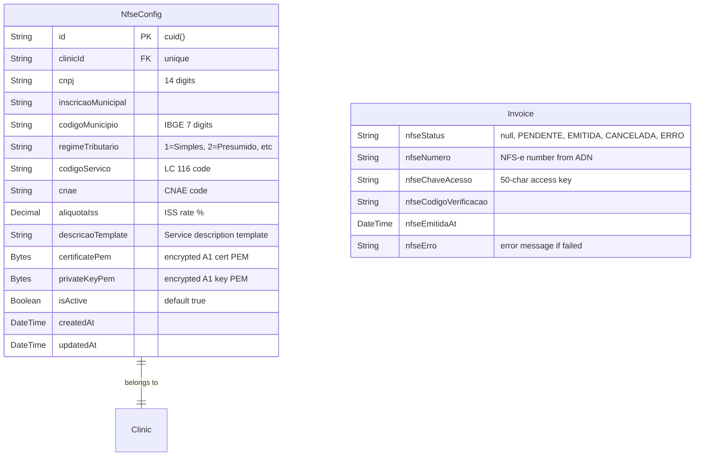

# NFS-e Nacional (ADN) Integration

## Overview

Integrate with the NFS-e Nacional (Ambiente de Dados Nacional / gov.br) API to emit electronic service invoices directly from the invoice module. Manual emission per invoice with clinic-level defaults and per-invoice override. Graceful fallback to existing manual NF tracking when the municipality is not on ADN.

## Problem Statement

Brazilian clinics must issue NFS-e for tax compliance. Currently, they use external prefecture portals or accounting software — a manual, error-prone process. Automating emission from within the billing system eliminates context-switching and ensures fiscal records stay in sync with financial data.

## Key Decisions (from brainstorm)

1. **NFS-e Nacional (ADN)** — free, government API, no per-nota cost (see brainstorm)
2. **Manual emission** — "Emitir NFS-e" button per invoice with review modal (see brainstorm)
3. **Clinic as emitter** — clinic CNPJ on the NFS-e (see brainstorm)
4. **Clinic defaults + per-invoice override** for service code, CNAE, ISS, description (see brainstorm)
5. **Graceful degradation** — manual NF toggle remains when ADN unavailable (see brainstorm)
6. **Follow bank reconciliation pattern** — encrypted credentials, HTTP client module (see brainstorm)

## Technical Approach

### ADN API Integration

The NFS-e Nacional uses:
- **mTLS authentication** with ICP-Brasil A1 certificate (PFX → extracted to PEM, same as bank reconciliation)
- **Synchronous emission** — POST DPS, receive NFS-e number immediately
- **DPS format** — XML (ABRASF 2.04), digitally signed, GZip-compressed, Base64-encoded, sent in JSON wrapper
- **Base URLs**: Production `https://sefin.nfse.gov.br/SefinNacional`, Sandbox `https://sefin.producaorestrita.nfse.gov.br/SefinNacional`

### Architecture (DDD)

New domain module: `src/lib/nfse/`

```
src/lib/nfse/
├── types.ts            # NFS-e types, config interfaces, status enum
├── adn-client.ts       # HTTP client for ADN API (mTLS, similar to inter-client.ts)
├── dps-builder.ts      # Builds DPS XML from invoice + clinic data
├── dps-builder.test.ts # TDD: XML structure, required fields, edge cases
├── xml-signer.ts       # XMLDSig signing with A1 certificate
├── validation.ts       # CNPJ validation, service code validation
├── validation.test.ts  # TDD: CNPJ check digits, service codes
└── index.ts            # Barrel exports
```

### Dependencies (npm)

```
xml-crypto          # XMLDSig signing (enveloped signature)
node-forge          # PFX/P12 parsing, PEM extraction
fast-xml-parser     # XML generation and parsing
```

### ERD



### Prisma Models

**New model — NfseConfig:**

```prisma
model NfseConfig {
  id                  String   @id @default(cuid())
  clinicId            String   @unique
  clinic              Clinic   @relation(fields: [clinicId], references: [id])

  cnpj                String   // 14 digits, validated
  inscricaoMunicipal  String
  codigoMunicipio     String   // IBGE 7-digit code
  regimeTributario    String   @default("1") // 1=Simples Nacional

  // Service defaults (overridable per invoice)
  codigoServico       String   // LC 116/2003 code e.g. "4.22"
  cnae                String?  // CNAE code
  codigoNbs           String?  // NBS code (mandatory since 01/2026)
  aliquotaIss         Decimal  @db.Decimal(5, 2)
  descricaoTemplate   String?  // e.g. "Servicos de psicologia clinica - {{paciente}}"

  // Encrypted A1 certificate (PEM extracted from PFX at upload)
  certificatePem      Bytes    // AES-256-GCM encrypted
  privateKeyPem       Bytes    // AES-256-GCM encrypted

  isActive            Boolean  @default(true)
  createdAt           DateTime @default(now())
  updatedAt           DateTime @updatedAt
}
```

**Extend Invoice model — add fields:**

```prisma
// Add to existing Invoice model
nfseStatus              String?   // null (not emitted), PENDENTE, EMITIDA, CANCELADA, ERRO
nfseNumero              String?   // NFS-e number from ADN
nfseChaveAcesso         String?   // 50-char access key for queries
nfseCodigoVerificacao   String?   // verification code
nfseEmitidaAt           DateTime? // emission timestamp from ADN
nfseErro                String?   // error message for retry
nfseCanceladaAt         DateTime?
nfseCancelamentoMotivo  String?
// Service data used for this specific emission (overrides from defaults)
nfseCodigoServico       String?
nfseDescricao           String?
nfseAliquotaIss         Decimal?  @db.Decimal(5, 2)
```

### API Routes

| Method | Route | Auth | Description |
|--------|-------|------|-------------|
| GET | `/api/admin/settings/nfse` | clinic_settings READ | Get NFS-e config |
| POST | `/api/admin/settings/nfse` | clinic_settings WRITE | Create/update NFS-e config + upload certificate |
| DELETE | `/api/admin/settings/nfse` | clinic_settings WRITE | Remove NFS-e config |
| POST | `/api/financeiro/faturas/[id]/nfse/emitir` | finances WRITE | Emit NFS-e for invoice |
| POST | `/api/financeiro/faturas/[id]/nfse/cancelar` | finances WRITE | Cancel NFS-e |
| GET | `/api/financeiro/faturas/[id]/nfse/status` | finances READ | Check NFS-e status / fetch PDF |

### UI Components

#### 1. NFS-e Settings Section — `src/app/admin/settings/` additions

New section in clinic settings page:
- CNPJ input (validated with check digits)
- Inscricao Municipal, Codigo Municipio (IBGE), Regime Tributario dropdown
- Service defaults: Codigo Servico, CNAE, NBS, Aliquota ISS, Descricao Template
- Certificate upload: file picker for .pfx + password input → extract PEM on server, encrypt, store
- "Testar Conexao" button to verify certificate against ADN sandbox

#### 2. Enhanced NfSection — replace `src/app/financeiro/faturas/[id]/NfSection.tsx`

When NfseConfig exists for the clinic:
- Replace manual toggle with NFS-e emission UI
- "Emitir NFS-e" button (visible for PAGO/ENVIADO invoices, not yet emitted)
- Pre-emission review modal showing:
  - Prestador: clinic name, CNPJ
  - Tomador: patient name, CPF (warning if missing)
  - Service: code, description (editable), value, ISS aliquota (editable)
  - "Confirmar Emissao" / "Cancelar"
- Post-emission: show NFS-e number, verification code, status badge, PDF download link
- Error state: show error message + "Tentar Novamente" button
- "Cancelar NFS-e" button with reason selection

When NfseConfig does NOT exist:
- Keep existing manual NF toggle (current behavior)

#### 3. Invoice List Badge — update `InvoiceTableBody.tsx`

Replace simple checkmark with richer badge:
- No NFS-e config: manual checkmark (current)
- Not emitted: empty
- EMITIDA: green badge "NFS-e #123"
- ERRO: red badge "Erro NFS-e"
- CANCELADA: gray badge "NFS-e Cancelada"

### Guardrails

- **Block invoice deletion** when `nfseStatus === "EMITIDA"` — require NFS-e cancellation first
- **Block invoice recalculation** when `nfseStatus === "EMITIDA"` — fiscal amount must match
- **Block concurrent emission** — check `nfseStatus !== null` before emitting (optimistic lock)
- **Require patient CPF** — show validation error in pre-emission modal if patient has no CPF, link to patient edit
- **CNPJ validation** — validate check digits on save in admin settings

### Audit Integration

New audit actions:
- `NFSE_EMITIDA` — NFS-e successfully emitted (stores nfseNumero, chaveAcesso)
- `NFSE_ERRO` — emission failed (stores error message)
- `NFSE_CANCELADA` — NFS-e cancelled (stores reason)
- `NFSE_CONFIG_UPDATED` — NFS-e settings changed

## Implementation Phases

### Phase 1: Domain Module + Data Model (TDD)

1. Install npm deps: `xml-crypto`, `node-forge`, `fast-xml-parser`
2. Create `src/lib/nfse/` domain module
3. **TDD**: `validation.test.ts` → `validation.ts` (CNPJ check digits, service code format)
4. **TDD**: `dps-builder.test.ts` → `dps-builder.ts` (XML structure, required fields, encoding)
5. Create `xml-signer.ts` (XMLDSig with A1 certificate)
6. Create `adn-client.ts` (mTLS HTTP client following `inter-client.ts` pattern)
7. Create `types.ts` and barrel `index.ts`
8. Add `NfseConfig` model to Prisma schema
9. Add NFS-e fields to Invoice model
10. Add audit actions and field labels
11. Run `prisma db push`

**Acceptance criteria:**
- [ ] DPS XML builder produces valid ABRASF 2.04 XML
- [ ] CNPJ validation catches invalid check digits
- [ ] Domain tests pass
- [ ] Schema applied

### Phase 2: API Routes — Config + Emission

1. Create NFS-e settings CRUD routes (`/api/admin/settings/nfse`)
   - PFX upload: parse with `node-forge`, extract PEM cert+key, encrypt, store
   - Test connection against ADN sandbox
2. Create emission route (`/api/financeiro/faturas/[id]/nfse/emitir`)
   - Build DPS XML from invoice + clinic + patient data + overrides
   - Sign XML, compress, encode
   - Call ADN API via mTLS
   - Store result (nfseNumero, chaveAcesso, etc.) or error
   - Audit log
3. Create cancellation route (`/api/financeiro/faturas/[id]/nfse/cancelar`)
4. Create status/PDF route (`/api/financeiro/faturas/[id]/nfse/status`)
5. Add guardrails: block delete/recalculate for invoices with active NFS-e

**Acceptance criteria:**
- [ ] Can configure NFS-e settings with certificate
- [ ] Can emit NFS-e for a PAGO invoice (sandbox)
- [ ] Can cancel an emitted NFS-e
- [ ] Can download official NFS-e PDF
- [ ] Audit logs for all NFS-e actions
- [ ] Invoice delete/recalculate blocked when NFS-e active

### Phase 3: UI

1. Add NFS-e settings section to admin settings page
2. Replace `NfSection.tsx` with conditional NFS-e / manual toggle
3. Build pre-emission review modal with override fields
4. Update invoice list badge
5. Error + retry UX

**Acceptance criteria:**
- [ ] Admin can configure NFS-e settings + upload certificate
- [ ] User can emit NFS-e from invoice detail with review
- [ ] User can override service code, description, ISS before emission
- [ ] NFS-e status visible in invoice list and detail
- [ ] Graceful fallback to manual toggle when NfseConfig not configured
- [ ] Patient without CPF shows clear error message

## Dependencies & Risks

| Risk | Mitigation |
|------|------------|
| ADN API may have municipality-specific field requirements | Query `parametros_municipais/{codigoMunicipio}` before emission to discover requirements |
| Vercel serverless + mTLS | Already working for bank reconciliation via `https.Agent` — same pattern |
| XML signing complexity | Use `xml-crypto` + `node-forge` (battle-tested libraries) |
| Network timeout during emission → phantom NFS-e | Implement "Verificar Status" query using `chaveAcesso` for error recovery |
| Patient CPF missing | Pre-emission validation with link to patient edit |
| Certificate expiry | Check expiry date on upload, warn in settings when nearing expiry |

## Future Considerations (NOT in scope)

- Auto-emit on PAGO status
- Batch emission ("Emitir todas do mes")
- Per-professional emission
- RPS (Recibo Provisorio de Servicos)
- NFS-e reports/dashboards
- Export for accounting software (contador)
- NFS-e de substituicao (replacement instead of cancellation)
- PENDENTE/PARCIAL invoice emission

## Sources & References

### Origin
- **Brainstorm:** [docs/brainstorms/2026-03-15-nfse-integration-brainstorm.md](docs/brainstorms/2026-03-15-nfse-integration-brainstorm.md) — key decisions: ADN provider, manual emission, clinic emitter, per-invoice override

### Internal References
- Bank reconciliation mTLS pattern: `src/lib/bank-reconciliation/inter-client.ts`
- Encryption module: `src/lib/bank-reconciliation/encryption.ts`
- Manual NF UI: `src/app/financeiro/faturas/[id]/NfSection.tsx`
- Invoice model: `prisma/schema.prisma:726-765`
- Invoice template variables: `src/lib/financeiro/invoice-template.ts`

### External References
- [NFS-e Nacional API Documentation](https://www.gov.br/nfse/pt-br/biblioteca/documentacao-tecnica/documentacao-atual)
- [Swagger — Contributors ISSQN API](https://www.nfse.gov.br/swagger/contribuintesissqn/)
- [ADN Sandbox](https://sefin.producaorestrita.nfse.gov.br/SefinNacional)
- [xml-crypto (XMLDSig)](https://github.com/node-saml/xml-crypto)
- [node-forge (PFX parsing)](https://github.com/digitalbazaar/forge)
- [Municipios Aderentes](https://www.gov.br/nfse/pt-br/municipios/municipios-aderentes)
