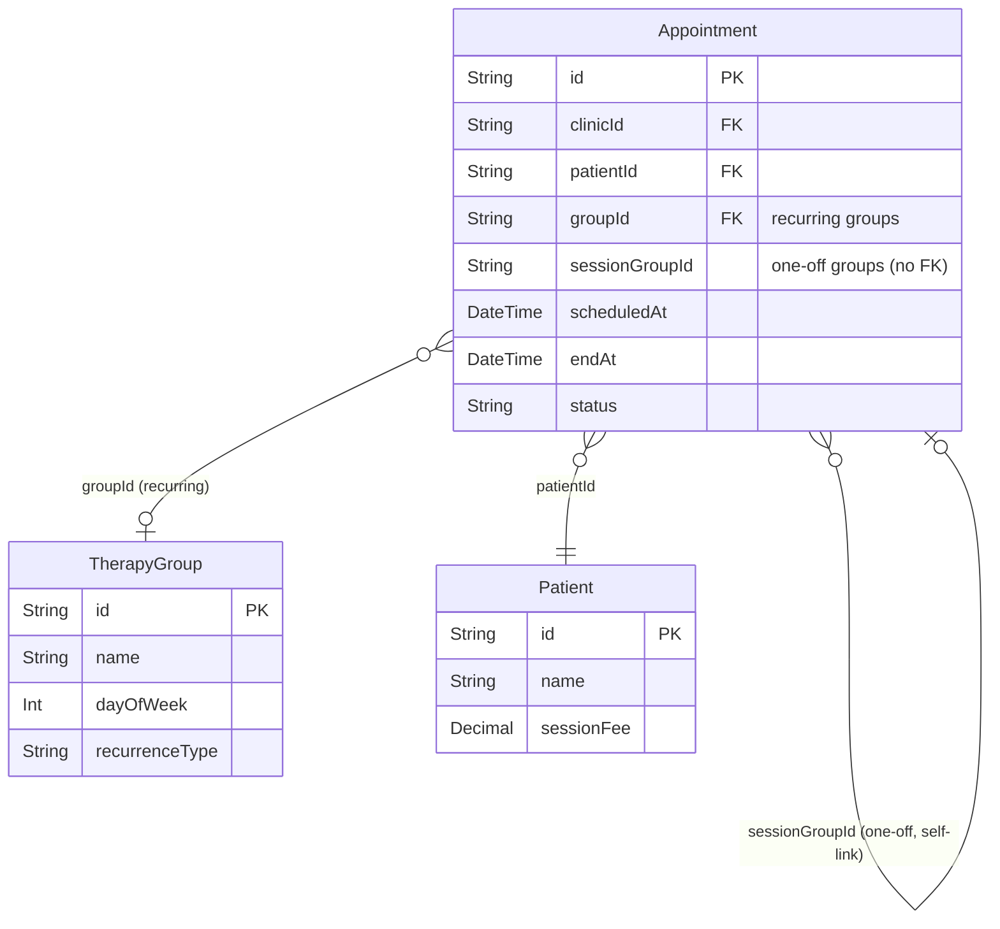

# One-off Group Sessions from Agenda & Past Date Scheduling

## Overview

Professionals can create a one-off group session directly from the agenda by selecting multiple patients — no TherapyGroup entity needed. Appointments are linked via a new `sessionGroupId` UUID field. Each patient is billed at their individual `sessionFee` as `SESSAO_GRUPO`. Calendar rendering, bulk status updates, and notifications behave identically to existing recurring group sessions.

Additionally, all appointment types can be scheduled for past dates (retroactive registration). The backend already allows this; only notification suppression needs to be added for past-date appointments.

(see brainstorm: `docs/brainstorms/2026-03-16-oneoff-groups-past-dates-brainstorm.md`)

## Problem Statement / Motivation

Professionals run one-off group sessions (workshops, assessments, substitute sessions) that don't fit recurring TherapyGroup patterns. Currently, the only way to create group sessions is through the TherapyGroup entity with mandatory recurrence — forcing professionals to either create a "fake" recurring group or log individual appointments that lose the group context for billing and calendar visibility.

Past-date scheduling solves the common scenario where a professional forgot to register a session and needs to add it retroactively.

## Proposed Solution

### 1. New `sessionGroupId` field on Appointment

A nullable `String` (UUID, no FK) that links one-off group appointments together. Mutually exclusive with `groupId` — an appointment belongs to either a recurring group OR a one-off group, never both.

### 2. New "Sessão em Grupo" FAB menu entry

Opens a dedicated creation sheet (`CreateGroupSessionSheet`) with multi-patient selection. On submit, creates N appointments atomically via an extended `POST /api/appointments` that accepts `patientIds: string[]`.

### 3. Extend existing infrastructure

Update calendar filtering, group-sessions API aggregation, bulk status, invoice classification, drag-and-drop exclusion, and notifications to handle `sessionGroupId` alongside `groupId`.

### 4. Suppress notifications for past-date appointments

Skip WhatsApp/email notifications when `scheduledAt` is in the past, for all appointment types.

## Technical Considerations

### Schema Migration

```
prisma/schema.prisma — Appointment model
```

```prisma
sessionGroupId  String?   // UUID linking one-off group appointments (no FK)
@@index([sessionGroupId])
@@index([clinicId, sessionGroupId])
```

`groupId` and `sessionGroupId` are mutually exclusive (enforced at application level in the creation handler).



### Conflict Checking

- Professional-level conflicts: checked as usual for the professional's time slot
- Patient-level conflicts: **warn but allow override** — show which patients have conflicts, let professional decide
- Self-conflict within group: all appointments in the same `sessionGroupId` are excluded from conflicting with each other (add `excludeSessionGroupId` parameter to `checkConflictsBulk`)

### Calendar Display Name

One-off group sessions have no `TherapyGroup.name`. Auto-generate from patient names:
- 1-2 patients: "Ana, Bruno"
- 3+ patients: "Ana, Bruno +1"

The `/api/group-sessions` endpoint returns a `groupName` field — for one-off sessions, build it server-side from the participants.

### Permissions

One-off group sessions use `agenda_own` WRITE permission (same as regular appointments). The `groups` feature permission continues to govern only recurring TherapyGroup management.

## System-Wide Impact

- **Calendar filtering**: `DailyOverviewGrid` and `WeeklyGrid` must filter out `sessionGroupId` appointments from individual lists (currently only filter `groupId`)
- **Drag-and-drop**: `useAppointmentDrag` must exclude `sessionGroupId` appointments (prevent breaking group coherence)
- **Group sessions API**: `/api/group-sessions` must aggregate by `sessionGroupId` in addition to `groupId`
- **Bulk status**: `/api/group-sessions/status` must support `sessionGroupId` as alternative to `groupId`
- **Invoice classification**: `classifyAppointments` must check `sessionGroupId` alongside `groupId`
- **Notifications**: Suppress for all past-date appointments (not just groups)
- **Audit logs**: One entry per appointment (existing pattern), include `sessionGroupId` in `newValues`

## Acceptance Criteria

### One-off Group Sessions

- [x] New `sessionGroupId` field on Appointment model (migration)
- [x] New "Sessão em Grupo" option in agenda FAB menu
- [x] `CreateGroupSessionSheet` with multi-patient selection (min 2 patients)
- [x] `POST /api/appointments` extended to accept `patientIds: string[]`, generates `sessionGroupId` server-side
- [x] One-off group sessions render as single card on daily view (`GroupSessionCard`)
- [x] One-off group sessions render as single block on weekly view (`GroupSessionBlock`)
- [x] Display name auto-generated from patient names
- [x] Bulk status update works via `sessionGroupId`
- [x] Individual patient status update works from `GroupSessionSheet`
- [x] Invoice classification: `SESSAO_GRUPO` for `sessionGroupId` appointments
- [x] Each patient billed at their individual `sessionFee`
- [x] Notifications sent to each patient on creation (with individual confirm/cancel links)
- [x] One-off group appointments excluded from drag-and-drop
- [x] Duplicate patient selection prevented in UI
- [ ] Conflict warning for patients with existing appointments at same time (allow override)

### Past Date Scheduling

- [x] Verify appointments can be created for past dates (already works — no code change)
- [x] Suppress notifications (WhatsApp + email) when `scheduledAt` is in the past
- [x] Suppress confirm/cancel link generation for past-date appointments

### Tests

- [x] `classifyAppointments` correctly classifies `sessionGroupId` appointments as `SESSAO_GRUPO`
- [ ] `sessionGroupId` and `groupId` mutual exclusivity validated
- [ ] Multi-patient appointment creation generates correct appointments
- [ ] Past-date notification suppression works

## Implementation Plan

### Phase 1: Schema & Backend

**1.1 Migration — `sessionGroupId` field**

```
prisma/schema.prisma
```

Add `sessionGroupId String?` with indexes `[sessionGroupId]` and `[clinicId, sessionGroupId]`.

Create migration: `npx prisma migrate dev --name add-session-group-id`

**1.2 Extend `POST /api/appointments` for multi-patient creation**

```
src/app/api/appointments/route.ts
```

- Accept optional `patientIds: string[]` in request body (alternative to `patientId`)
- When `patientIds` is present and length >= 2:
  - Generate `sessionGroupId = crypto.randomUUID()`
  - Validate all patients exist and belong to clinic
  - Check professional-level conflicts (once — same time slot)
  - Check patient-level conflicts for each patient (warn, don't block — return `conflictWarnings` in response)
  - Create all appointments in a single `prisma.$transaction`
  - Each appointment: `type: CONSULTA`, `sessionGroupId`, patient's own `patientId`
  - `price` left null (invoice generator uses patient's `sessionFee`)
  - Send notifications per patient (skip if `scheduledAt` is in the past)
- Extract multi-patient creation logic into `src/lib/appointments/create-group-session.ts`

**1.3 Update conflict checking**

```
src/lib/appointments/conflicts.ts (or wherever checkConflictsBulk lives)
```

- Add `excludeSessionGroupId?: string` parameter
- When checking conflicts for group creation, exclude appointments with the same `sessionGroupId`

**1.4 Suppress notifications for past dates**

```
src/app/api/appointments/route.ts
```

- In `handleCreateAppointment` and the new multi-patient path: skip `createNotification()` calls when `scheduledAt < now()`
- Also skip confirm/cancel link generation (HMAC URLs are meaningless for past sessions)

### Phase 2: Group Sessions API & Status

**2.1 Extend `/api/group-sessions` aggregation**

```
src/app/api/group-sessions/route.ts
```

- Query appointments where `groupId IS NOT NULL OR sessionGroupId IS NOT NULL`
- Aggregation key: for `groupId` appointments use `${groupId}:${scheduledAt}` (existing), for `sessionGroupId` appointments use `session:${sessionGroupId}:${scheduledAt}`
- For one-off sessions, build `groupName` from participant names (e.g., "Ana, Bruno +1")
- Add `sessionGroupId` to the returned session object
- Add `isOneOff: boolean` flag to distinguish from recurring

**2.2 Extend `/api/group-sessions/status` bulk update**

```
src/app/api/group-sessions/status/route.ts
```

- Accept optional `sessionGroupId` as alternative to `groupId` in request body
- Query by `sessionGroupId + scheduledAt` when provided
- Same status transition logic, credit handling, audit logging

**2.3 Update `GroupSessionSheet` to handle one-off sessions**

```
src/app/agenda/components/GroupSessionSheet.tsx
```

- When session has `sessionGroupId` instead of `groupId`, pass `sessionGroupId` to bulk status API
- Display auto-generated name instead of `groupName` from TherapyGroup

### Phase 3: Calendar Rendering

**3.1 Update calendar filters**

```
src/app/agenda/components/DailyOverviewGrid.tsx
src/app/agenda/weekly/components/WeeklyGrid.tsx
```

- Change filter from `!apt.groupId` to `!apt.groupId && !apt.sessionGroupId`
- One-off group sessions will appear via the group sessions data path

**3.2 Update drag-and-drop exclusion**

```
src/app/agenda/hooks/useAppointmentDrag.ts
```

- Add `!apt.sessionGroupId` to the drag source filter

**3.3 Update `GroupSessionCard` and `GroupSessionBlock`**

```
src/app/agenda/components/GroupSessionCard.tsx
src/app/agenda/weekly/components/GroupSessionBlock.tsx
```

- Handle `groupName` being auto-generated (no code change needed if API provides it)
- Possibly add a visual indicator for "one-off" vs "recurring" (subtle, optional)

### Phase 4: Billing

**4.1 Update `classifyAppointments`**

```
src/lib/financeiro/invoice-generator.ts
```

Change:
```typescript
if (apt.groupId) group.push(apt)
```
To:
```typescript
if (apt.groupId || apt.sessionGroupId) group.push(apt)
```

**4.2 Update invoice item description**

```
src/lib/financeiro/invoice-generator.ts
```

For `sessionGroupId` appointments without a `TherapyGroup.name`, use "Sessão grupo" (generic) or derive from patient context.

### Phase 5: UI — Creation Flow

**5.1 New FAB menu entry**

```
src/app/agenda/components/AgendaFabMenu.tsx
```

Add "Sessão em Grupo" option that opens `CreateGroupSessionSheet`.

**5.2 `MultiPatientSearch` component**

```
src/app/agenda/components/MultiPatientSearch.tsx (new)
```

- Based on existing `PatientSearch` but supports selecting multiple patients
- Shows selected patients as removable chips/tags
- Prevents duplicate selection
- Search/filter behavior identical to `PatientSearch`

**5.3 `CreateGroupSessionSheet` component**

```
src/app/agenda/components/CreateGroupSessionSheet.tsx (new)
```

- Fields: date (DD/MM/YYYY), start time, duration, modality, patients (multi-select), additional professionals, notes
- No recurrence options (one-off only)
- On submit: calls `POST /api/appointments` with `patientIds`
- Shows conflict warnings if any patients have overlapping appointments
- Allow past dates (no date restriction)

### Phase 6: Tests

**6.1 Domain logic tests**

```
src/lib/financeiro/invoice-generator.test.ts — update classifyAppointments tests
src/lib/appointments/create-group-session.test.ts (new) — multi-patient creation logic
```

**6.2 Key test cases**

- `classifyAppointments` returns `SESSAO_GRUPO` for appointments with `sessionGroupId`
- `classifyAppointments` returns `SESSAO_GRUPO` for appointments with `groupId` (existing, unchanged)
- Multi-patient creation generates correct number of appointments with shared `sessionGroupId`
- `sessionGroupId` and `groupId` cannot both be set on same appointment
- Notifications suppressed for past-date appointments
- Conflict checking excludes same `sessionGroupId` appointments

## Key Files Changed

| File | Change |
|------|--------|
| `prisma/schema.prisma` | Add `sessionGroupId` field + indexes |
| `src/app/api/appointments/route.ts` | Multi-patient creation, past-date notification suppression |
| `src/lib/appointments/create-group-session.ts` | New — extracted creation logic |
| `src/lib/appointments/conflicts.ts` | `excludeSessionGroupId` parameter |
| `src/app/api/group-sessions/route.ts` | Aggregate by `sessionGroupId` |
| `src/app/api/group-sessions/status/route.ts` | Support `sessionGroupId` |
| `src/app/agenda/components/DailyOverviewGrid.tsx` | Filter update |
| `src/app/agenda/weekly/components/WeeklyGrid.tsx` | Filter update |
| `src/app/agenda/hooks/useAppointmentDrag.ts` | Exclude `sessionGroupId` from drag |
| `src/app/agenda/components/GroupSessionCard.tsx` | Handle auto-generated name |
| `src/app/agenda/components/GroupSessionSheet.tsx` | Pass `sessionGroupId` to status API |
| `src/app/agenda/components/AgendaFabMenu.tsx` | New "Sessão em Grupo" entry |
| `src/app/agenda/components/MultiPatientSearch.tsx` | New — multi-patient selector |
| `src/app/agenda/components/CreateGroupSessionSheet.tsx` | New — creation form |
| `src/lib/financeiro/invoice-generator.ts` | Check `sessionGroupId` in classification |
| `src/lib/financeiro/invoice-generator.test.ts` | New test cases |
| `src/lib/appointments/create-group-session.test.ts` | New test file |

## Sources & References

- **Origin brainstorm:** [docs/brainstorms/2026-03-16-oneoff-groups-past-dates-brainstorm.md](docs/brainstorms/2026-03-16-oneoff-groups-past-dates-brainstorm.md) — key decisions: `sessionGroupId` UUID (no FK), individual `sessionFee` billing, agenda entry point, same behavior as recurring groups
- Existing group session generation: `src/app/api/groups/[groupId]/sessions/route.ts`
- Invoice classification: `src/lib/financeiro/invoice-generator.ts:52`
- Calendar filtering: `src/app/agenda/components/DailyOverviewGrid.tsx`, `src/app/agenda/weekly/components/WeeklyGrid.tsx`
- Bulk status: `src/app/api/group-sessions/status/route.ts`
- FAB menu: `src/app/agenda/components/AgendaFabMenu.tsx`
