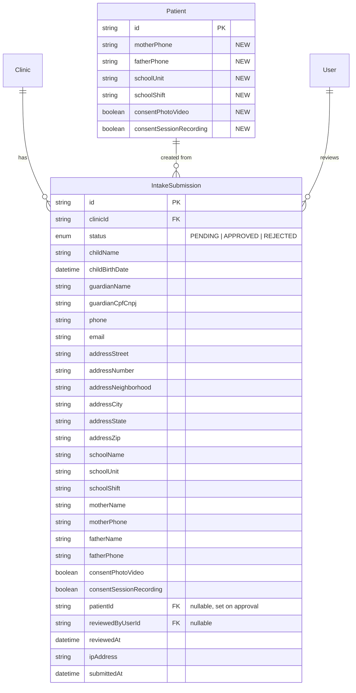

# feat: Public Intake Form for Patient Registration

## Overview

Replace the current Google Form workflow with an in-app public intake form per clinic. Parents/guardians visit `/intake/[clinic-slug]`, fill out child and family information, and submit. Submissions are stored in a separate `IntakeSubmission` table and reviewed by clinic admins under the Patients menu. Approval creates a Patient record and prompts scheduling the first appointment. Rejection keeps the record for reference.

(see brainstorm: docs/brainstorms/2026-03-19-intake-form-brainstorm.md)

## Problem Statement / Motivation

Clinics currently use Google Forms to collect patient intake data, then manually re-enter it into the system. This creates duplicate data entry, risk of transcription errors, and no audit trail. The intake form brings this workflow into the product, capturing data directly into the database with a review step before patient creation.

## Proposed Solution

### Data Model

New `IntakeSubmission` model + `IntakeSubmissionStatus` enum. New fields on `Patient` model. New `INTAKE_FORM_SUBMITTED` notification type.

### Public Form

A dedicated page at `/intake/[slug]` (no app chrome) with clinic branding. Submits via `POST /api/public/intake/[slug]`. Rate limited, Zod validated.

### Admin Review

A tab under the Patients page showing submissions with status filter. Click to review/edit, then approve (creates Patient + redirects to schedule appointment) or reject (marks as rejected).

## Technical Approach

### Phase 1: Schema & Domain Module

#### 1.1 Prisma Schema Changes

**New enum — `IntakeSubmissionStatus`:**
```prisma
enum IntakeSubmissionStatus {
  PENDING
  APPROVED
  REJECTED
}
```

**New model — `IntakeSubmission`:**
```prisma
model IntakeSubmission {
  id        String   @id @default(cuid())
  clinicId  String
  clinic    Clinic   @relation(fields: [clinicId], references: [id])
  status    IntakeSubmissionStatus @default(PENDING)

  // Child/adolescent info
  childName     String
  childBirthDate DateTime @db.Date

  // Guardian (responsavel financeiro)
  guardianName  String
  guardianCpfCnpj String

  // Contact
  phone         String
  email         String

  // Address
  addressStreet       String
  addressNumber       String?
  addressNeighborhood String?
  addressCity         String?
  addressState        String?  @db.VarChar(2)
  addressZip          String   @db.VarChar(8)

  // School
  schoolName    String?
  schoolUnit    String?
  schoolShift   String?

  // Parents
  motherName    String?
  motherPhone   String?
  fatherName    String?
  fatherPhone   String?

  // Consents
  consentPhotoVideo       Boolean @default(false)
  consentSessionRecording Boolean @default(false)

  // Review tracking
  patientId       String?   // set on approval, links to created Patient
  patient         Patient?  @relation(fields: [patientId], references: [id])
  reviewedByUserId String?
  reviewedBy      User?     @relation(fields: [reviewedByUserId], references: [id])
  reviewedAt      DateTime?

  // Metadata
  ipAddress   String?
  submittedAt DateTime @default(now())
  createdAt   DateTime @default(now())
  updatedAt   DateTime @updatedAt

  @@index([clinicId, status])
  @@index([clinicId, submittedAt])
}
```

**New fields on `Patient` model:**
```prisma
  motherPhone              String?
  fatherPhone              String?
  schoolUnit               String?
  schoolShift              String?
  consentPhotoVideo        Boolean @default(false)
  consentPhotoVideoAt      DateTime?
  consentSessionRecording  Boolean @default(false)
  consentSessionRecordingAt DateTime?
```

**New `NotificationType` value:** `INTAKE_FORM_SUBMITTED`

**Relations to add:**
- `Clinic` model: add `intakeSubmissions IntakeSubmission[]`
- `Patient` model: add `intakeSubmissions IntakeSubmission[]`
- `User` model: add `reviewedIntakeSubmissions IntakeSubmission[]`

**Migration:** Use `npx prisma migrate dev --name add-intake-submission`. Remember `git add -f prisma/migrations/` for the SQL file (see brainstorm: critical learning about never using `db push`).

#### 1.2 Domain Module — `src/lib/intake/`

**Files:**

`src/lib/intake/types.ts` — Zod schemas and TypeScript types:
- `intakeSubmissionSchema` — Zod schema for public form validation
- `IntakeSubmissionInput` — inferred type from schema
- `intakeApprovalSchema` — Zod schema for admin edit/approval

`src/lib/intake/mapping.ts` — Pure function mapping IntakeSubmission → Patient creation data:
```
Field Mapping:
  childName           → Patient.name
  childBirthDate      → Patient.birthDate
  guardianName        → Patient.billingResponsibleName
  guardianCpfCnpj     → Patient.billingCpf AND Patient.cpf
  phone               → Patient.phone
  email               → Patient.email
  addressStreet       → Patient.addressStreet
  addressNumber       → Patient.addressNumber
  addressNeighborhood → Patient.addressNeighborhood
  addressCity         → Patient.addressCity
  addressState        → Patient.addressState
  addressZip          → Patient.addressZip
  schoolName          → Patient.schoolName
  schoolUnit          → Patient.schoolUnit
  schoolShift         → Patient.schoolShift
  motherName          → Patient.motherName
  motherPhone         → Patient.motherPhone
  fatherName          → Patient.fatherName
  fatherPhone         → Patient.fatherPhone
  consentPhotoVideo        → Patient.consentPhotoVideo (+ timestamp)
  consentSessionRecording  → Patient.consentSessionRecording (+ timestamp)
```

`src/lib/intake/index.ts` — Barrel export.

`src/lib/intake/mapping.test.ts` — Unit tests for the mapping function.
`src/lib/intake/types.test.ts` — Unit tests for Zod schema validation (edge cases: CPF format, phone format, required vs optional fields).

#### 1.3 Auth Config

Add `/intake` to public routes in `src/lib/auth.config.ts`:
```typescript
const isIntakePage = nextUrl.pathname.startsWith("/intake")
```
Add to the condition that allows unauthenticated access.

### Phase 2: Public Form

#### 2.1 API Route — `src/app/api/public/intake/[slug]/route.ts`

POST handler:
1. Extract IP, check rate limit (`intake-submit:${ip}`, `RATE_LIMIT_CONFIGS.publicApi`)
2. Parse and validate body with `intakeSubmissionSchema`
3. Look up clinic by slug — return 404 if not found or `isActive=false`
4. Create `IntakeSubmission` record with `status: PENDING`
5. Send notification to clinic admins (email to all ADMIN users)
6. Return 201 with success message

No auth. Portuguese error messages. Follow the signup route pattern.

#### 2.2 Public Page — `src/app/intake/[slug]/page.tsx`

**Layout:** Create `src/app/intake/layout.tsx` — minimal layout without DesktopHeader, BottomNavigation, SubscriptionBanner. Just the page content centered.

**Page structure:**
- Fetch clinic info by slug (name, logoUrl) via `GET /api/public/intake/[slug]`
- Show clinic name + logo at top
- Multi-section form using react-hook-form + Zod resolver
- Form sections: Child Info → Guardian Info → Address → School → Parents → Consents
- CEP auto-fill via ViaCEP API (standard Brazilian pattern)
- Phone inputs with Brazilian mask `(XX) XXXXX-XXXX`
- Date input with DD/MM/YYYY mask (per CLAUDE.md, no native date picker)
- Consent checkboxes with full legal text
- Submit button with loading state
- Success state: simple "Obrigado" message
- Error state: retry option

**Also add:** `GET /api/public/intake/[slug]` route to fetch clinic public info (name, logo, slug) for the form page.

#### 2.3 New Files

```
src/app/intake/layout.tsx                      — minimal public layout
src/app/intake/[slug]/page.tsx                 — public form page
src/app/api/public/intake/[slug]/route.ts      — POST (submit) + GET (clinic info)
```

### Phase 3: Admin Review UI

#### 3.1 API Routes

**`src/app/api/intake-submissions/route.ts`** — Protected by `withFeatureAuth({ feature: "patients", minAccess: "READ" })`:
- GET: List submissions for the clinic. Query params: `status` (filter), `search` (child name/guardian name), `page`, `limit`. Default: exclude REJECTED.

**`src/app/api/intake-submissions/[id]/route.ts`** — Protected:
- GET: Fetch single submission detail (READ access)
- PUT: Edit submission fields (WRITE access)
- PATCH: Approve or reject (WRITE access)

**Approve action (PATCH with `action: "approve"`):**
1. Validate submission is PENDING
2. Map submission data to Patient fields using `mapping.ts`
3. Check for CPF conflict — if `@@unique([clinicId, cpf])` would be violated, return error with existing patient info so admin can decide
4. In a `$transaction`: create Patient, update submission (status=APPROVED, patientId, reviewedByUserId, reviewedAt), create audit log
5. Return the new `patientId` for redirect

**Reject action (PATCH with `action: "reject"`):**
1. Validate submission is PENDING
2. Update status to REJECTED, set reviewedByUserId, reviewedAt
3. Create audit log

#### 3.2 Patients Page — Add Intake Tab

Modify `src/app/patients/page.tsx` to add a tab bar at the top switching between "Pacientes" and "Fichas de Cadastro". The intake tab renders a new `IntakeSubmissionsList` component.

**New components:**
```
src/app/patients/components/IntakeSubmissionsList.tsx  — list with status filter, search, pagination
src/app/patients/components/IntakeSubmissionDetail.tsx — review/edit form with approve/reject buttons
```

**List view:** Table with columns: child name, guardian name, phone, submitted date, status. Status filter dropdown (default: PENDING only). Search by child name or guardian name.

**Detail view:** Opens in the existing bottom sheet pattern (same as patient create/edit). Shows all fields editable. Two action buttons: "Aprovar e Agendar" (green) and "Rejeitar" (red/outline).

#### 3.3 Approve → Schedule Flow

On successful approval, redirect to `/agenda` with query params to pre-fill a new appointment:
```
/agenda?newAppointment=true&patientId={newPatientId}
```
The agenda page already supports opening the new appointment form — it just needs to accept a `patientId` query param to pre-select the patient.

### Phase 4: Notifications

#### 4.1 Notification Template

Add to `src/lib/notifications/templates.ts` a default template for `INTAKE_FORM_SUBMITTED`:

**Email channel:**
- Subject: `Nova ficha de cadastro recebida`
- Body: `Uma nova ficha de cadastro foi preenchida por {{guardianName}} para {{childName}}. Acesse o sistema para revisar.`

#### 4.2 Send on Submission

In the public intake API route, after creating the submission:
1. Query all ADMIN users for the clinic
2. For each admin with an email, call `createAndSendNotification()` with channel EMAIL
3. Fire-and-forget (don't block the response on notification delivery)

### Phase 5: Audit Logging

Add new audit actions:
- `INTAKE_SUBMITTED` — logged on public submission (no user, just IP)
- `INTAKE_APPROVED` — logged when admin approves
- `INTAKE_REJECTED` — logged when admin rejects

Add field labels in `src/lib/audit/field-labels.ts` for IntakeSubmission fields.

## ERD Diagram



## Acceptance Criteria

### Functional

- [ ] Public form accessible at `/intake/[slug]` without authentication
- [ ] Form shows clinic name and logo (graceful fallback when no logo)
- [ ] Form validates all required fields with inline error messages (Portuguese)
- [ ] CEP auto-fills address fields via ViaCEP
- [ ] Phone inputs use Brazilian mask format
- [ ] Date input uses DD/MM/YYYY format (no native date picker)
- [ ] Consent checkboxes show full legal authorization text
- [ ] Submission creates an `IntakeSubmission` with status PENDING
- [ ] Clinic admins receive email notification on new submission
- [ ] Admin can view submissions list under Patients menu with status filter
- [ ] Default filter hides REJECTED submissions
- [ ] Admin can search submissions by child name or guardian name
- [ ] Admin can view and edit submission details before approving
- [ ] Approve creates a Patient with correct field mapping, in a transaction
- [ ] If CPF conflicts with existing Patient, show clear error with patient info
- [ ] After approval, redirect to agenda with new patient pre-selected for scheduling
- [ ] Reject marks submission as REJECTED with reviewer info
- [ ] Rejected submissions remain visible when filter is changed
- [ ] Audit log entries for submit, approve, and reject actions
- [ ] Rate limiting on public route (10 req/min per IP)
- [ ] Returns 404 for invalid slugs or inactive clinics

### Non-Functional

- [ ] Public form loads in <2s on 3G connection
- [ ] Form is mobile-responsive (most parents will use phone)
- [ ] All text in Brazilian Portuguese
- [ ] No app navigation chrome on public pages
- [ ] RBAC: uses `patients` feature — WRITE for approve/reject, READ for view

## System-Wide Impact

- **Auth config**: Add `/intake` to public route allowlist in `auth.config.ts`
- **Patient model**: 6 new optional fields — no impact on existing patients (all nullable/defaulted)
- **NotificationType enum**: New value requires migration — non-reversible ALTER TYPE in Postgres
- **Patients page**: Add tab bar — existing patient list unchanged, just wrapped in a tab
- **Agenda page**: Accept `patientId` query param to pre-fill new appointment form
- **Audit system**: 3 new action types

## Dependencies & Risks

- **Migration risk**: Enum ALTER TYPE is non-reversible. Test migration on local DB first.
- **Patients page complexity**: At 711 lines, adding tabs may push it further. Extract the intake list into its own component to contain complexity.
- **Agenda integration**: The `?patientId=` pre-fill requires a small change to the agenda page — verify it can accept and use this param.

## Sources & References

- **Origin brainstorm:** [docs/brainstorms/2026-03-19-intake-form-brainstorm.md](docs/brainstorms/2026-03-19-intake-form-brainstorm.md) — Key decisions: separate IntakeSubmission table, fixed form fields, structured consents, approve+schedule flow
- **Public route pattern:** `src/app/api/public/signup/route.ts` — Zod validation, rate limiting, slug lookup
- **Public page pattern:** `src/app/confirm/page.tsx` — centered card layout, state machine, useMountEffect
- **Patient creation:** `src/app/api/patients/route.ts` — phone regex, CPF normalization, consent timestamps
- **RBAC features:** `src/lib/rbac/types.ts` — reusing `patients` feature
- **Notification templates:** `src/lib/notifications/templates.ts` — DEFAULT_TEMPLATES pattern
- **Critical learning:** Never use `prisma db push` — always create migration files
