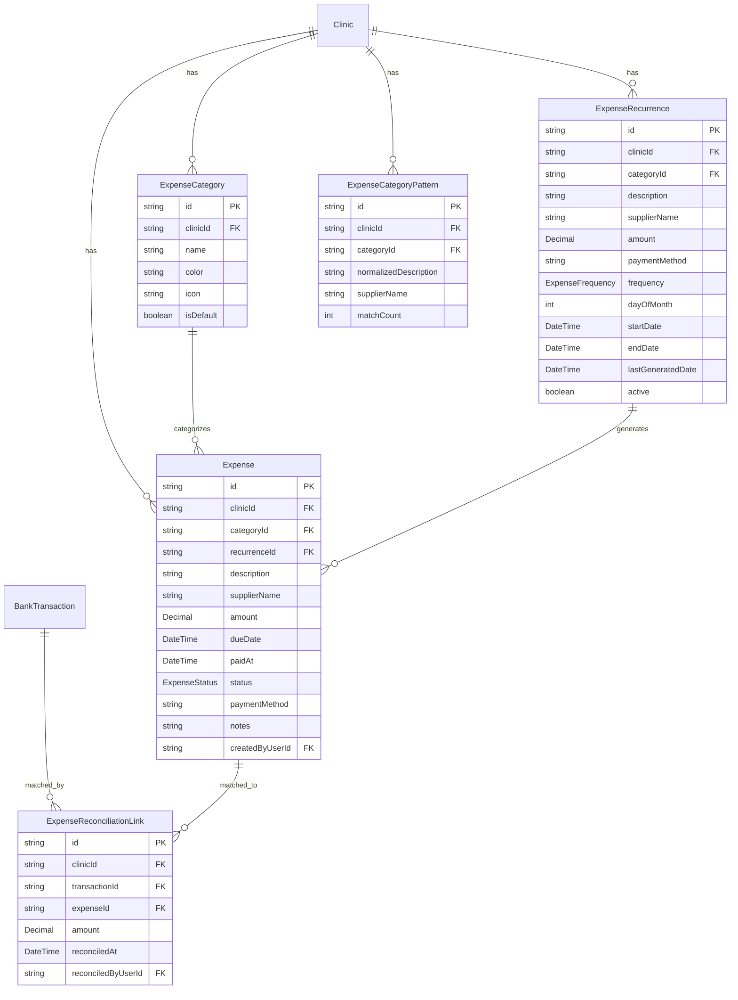

# AP/AR & Cash Flow Management

## Overview

Add expense tracking (Accounts Payable), cash flow projections, bank statement import, and smart categorization to the existing Clinica financial module. The revenue side (AR) — invoices, NFS-e, session credits, repasse, bank reconciliation — is already production-ready. This plan adds the **expenses side** and a **unified cash flow view** that combines both.

Target user: clinic owner/admin who wants to answer "Is my clinic profitable?", "What bills are due?", and "Will I have enough cash next month?"

(see brainstorm: `docs/brainstorms/2026-03-26-ap-ar-cashflow-brainstorm.md`)

## Problem Statement

Clinic owners currently track expenses in spreadsheets or not at all. The existing financeiro module only tracks revenue (invoices). Without expense data, there's no profitability view, no cash flow projection, and no bill management. Owners lack financial visibility to make decisions like hiring, expanding, or cutting costs.

## Technical Approach

### Architecture

Follow existing DDD patterns: domain modules in `src/lib/` with pure functions, thin API route adapters, colocated tests. New modules:

- `src/lib/expenses/` — expense status transitions, recurrence generation, validation, format helpers
- `src/lib/cashflow/` — projection calculator, period aggregation, alert rules
- `src/lib/bank-statement-parser/` — OFX/CSV parsing, normalization, provider abstraction
- `src/lib/expense-matcher/` — pattern matching for expense categorization

### Data Model



### Key Design Decisions

**1. Expense status state machine:**
```
DRAFT → OPEN (activate)
DRAFT → CANCELLED (discard)
OPEN → PAID (mark paid, sets paidAt)
OPEN → OVERDUE (cron: dueDate < today)
OPEN → CANCELLED (user cancels)
OVERDUE → PAID (late payment)
OVERDUE → CANCELLED (write off)
PAID → terminal (no reversal)
CANCELLED → terminal (no reactivation)
```
Manual entry defaults to OPEN. Recurring auto-generated entries also default to OPEN.

**2. ExpenseReconciliationLink (join table, not direct FK):** Consistent with existing `ReconciliationLink` for invoices. Supports future one-to-many matching. A single bank transaction could pay a combined bill.

**3. Separate RBAC feature `"expenses"`:** ADMIN=WRITE, PROFESSIONAL=NONE. Expenses are clinic-level financial data — professionals shouldn't see rent, utility costs, etc. by default. Override is possible via UserPermission.

**4. Amount is always positive.** Expenses are outflows by definition. Cash flow calculations subtract expense amounts from invoice amounts.

**5. Recurrence uses structured fields, not JSON blob.** The `ExpenseRecurrence` model has explicit typed columns for each template field. Avoids runtime schema validation issues.

**6. New `ExpenseFrequency` enum (MONTHLY/YEARLY).** Separate from the existing appointment `RecurrenceType` to avoid coupling. WEEKLY is omitted — clinic expenses are virtually never weekly.

**7. Bank transaction fetch route must be refactored.** The current `deleteMany` on line 69 of `src/app/api/financeiro/conciliacao/fetch/route.ts` deletes all unmatched, undismissed transactions. This must be scoped to only delete CREDIT transactions to preserve DEBIT transactions used for expense matching.

**8. Cash flow projections are relative (net flow), not absolute.** No reliable real-time bank balance source exists. User can optionally set a manual starting balance. Projections show: "Based on your open invoices and expenses, here's your net cash flow over the next 90 days."

**9. Categories use RESTRICT on delete.** Can't delete a category that has expenses. User must reassign first.

**10. Extend `TransactionDismissReason` enum** with `PERSONAL_EXPENSE` and `TRANSFER` for DEBIT transactions.

---

## Implementation Phases

### Phase 1: Accounts Payable Foundation

#### 1.1 Schema & Migration

**New enums in `prisma/schema.prisma`:**

```prisma
enum ExpenseStatus {
  DRAFT
  OPEN
  PAID
  OVERDUE
  CANCELLED
}

enum ExpenseFrequency {
  MONTHLY
  YEARLY
}
```

**Extend existing enum:**
```prisma
enum TransactionDismissReason {
  DUPLICATE
  NOT_PATIENT
  PERSONAL_EXPENSE
  TRANSFER
}
```

**New models:**

```prisma
model ExpenseCategory {
  id        String   @id @default(cuid())
  clinicId  String
  name      String
  color     String   @default("#6B7280")
  icon      String?
  isDefault Boolean  @default(false)
  createdAt DateTime @default(now())
  updatedAt DateTime @updatedAt

  clinic   Clinic    @relation(fields: [clinicId], references: [id], onDelete: Cascade)
  expenses Expense[]

  @@unique([clinicId, name])
  @@index([clinicId])
}

model Expense {
  id              String        @id @default(cuid())
  clinicId        String
  categoryId      String?
  recurrenceId    String?
  description     String
  supplierName    String?
  amount          Decimal       @db.Decimal(10, 2)
  dueDate         DateTime      @db.Date
  paidAt          DateTime?
  status          ExpenseStatus @default(OPEN)
  paymentMethod   String?
  notes           String?
  createdByUserId String?
  createdAt       DateTime      @default(now())
  updatedAt       DateTime      @updatedAt

  clinic            Clinic                     @relation(fields: [clinicId], references: [id], onDelete: Cascade)
  category          ExpenseCategory?           @relation(fields: [categoryId], references: [id], onDelete: SetNull)
  recurrence        ExpenseRecurrence?         @relation(fields: [recurrenceId], references: [id], onDelete: SetNull)
  createdByUser     User?                      @relation("CreatedExpenses", fields: [createdByUserId], references: [id], onDelete: SetNull)
  reconciliationLinks ExpenseReconciliationLink[]

  @@index([clinicId])
  @@index([clinicId, status])
  @@index([clinicId, dueDate])
  @@index([clinicId, categoryId])
  @@index([recurrenceId])
}

model ExpenseRecurrence {
  id                String           @id @default(cuid())
  clinicId          String
  categoryId        String?
  description       String
  supplierName      String?
  amount            Decimal          @db.Decimal(10, 2)
  paymentMethod     String?
  frequency         ExpenseFrequency @default(MONTHLY)
  dayOfMonth        Int              @default(1)
  startDate         DateTime         @db.Date
  endDate           DateTime?        @db.Date
  lastGeneratedDate DateTime?        @db.Date
  active            Boolean          @default(true)
  createdAt         DateTime         @default(now())
  updatedAt         DateTime         @updatedAt

  clinic   Clinic    @relation(fields: [clinicId], references: [id], onDelete: Cascade)
  expenses Expense[]

  @@index([clinicId])
  @@index([clinicId, active])
}

model ExpenseReconciliationLink {
  id                 String   @id @default(cuid())
  clinicId           String
  transactionId      String
  expenseId          String
  amount             Decimal  @db.Decimal(10, 2)
  reconciledAt       DateTime @default(now())
  reconciledByUserId String?

  clinic           Clinic          @relation(fields: [clinicId], references: [id], onDelete: Cascade)
  transaction      BankTransaction @relation(fields: [transactionId], references: [id], onDelete: Cascade)
  expense          Expense         @relation(fields: [expenseId], references: [id], onDelete: Cascade)
  reconciledByUser User?           @relation("ReconciledExpenses", fields: [reconciledByUserId], references: [id], onDelete: SetNull)

  @@unique([transactionId, expenseId])
  @@index([expenseId])
  @@index([clinicId])
}
```

**Migration:** Create with `npx prisma migrate dev --name add_expense_models`. Remember to `git add -f prisma/migrations/` since `.gitignore` blocks `*.sql`.

**Seed default categories** in migration SQL or seed script:
- Aluguel (rent), Energia (electricity), Agua (water), Internet/Telefone, Material de Escritorio (office supplies), Software/Assinaturas, Limpeza (cleaning), Manutencao (maintenance), Marketing, Capacitacao (training), Honorarios Profissionais (professional fees), Impostos (taxes), Outros (other)

#### 1.2 Domain Module — `src/lib/expenses/`

Files to create:

| File | Purpose | ~Lines |
|------|---------|--------|
| `types.ts` | Shared types: `ExpenseForList`, `ExpenseFilters`, `CreateExpenseInput`, `UpdateExpenseInput` | ~40 |
| `status-transitions.ts` | `isValidTransition(from, to)`, `VALID_TRANSITIONS` map | ~30 |
| `status-transitions.test.ts` | Test all valid/invalid transitions | ~60 |
| `recurrence.ts` | `generateExpensesFromRecurrence(recurrence, upToDate)` → `CreateExpenseInput[]`, `calculateNextDueDate(frequency, dayOfMonth, afterDate)` | ~80 |
| `recurrence.test.ts` | Test monthly/yearly generation, day-of-month edge cases (31st in Feb), end date, already-generated filtering | ~100 |
| `format.ts` | `formatExpenseStatus(status)` → PT-BR label, `formatFrequency()` | ~30 |
| `format.test.ts` | Label tests | ~20 |
| `seed-categories.ts` | `DEFAULT_CATEGORIES` array with name, color, icon for seeding | ~40 |
| `index.ts` | Barrel exports | ~15 |

#### 1.3 RBAC Update

**`src/lib/rbac/types.ts`:**
- Add `"expenses"` to `FEATURES` array
- Add `expenses: "Despesas"` to `FEATURE_LABELS`

**`src/lib/rbac/permissions.ts`:**
- Add to `ROLE_DEFAULTS.ADMIN`: `expenses: "WRITE"`
- Add to `ROLE_DEFAULTS.PROFESSIONAL`: `expenses: "NONE"`

#### 1.4 API Routes

**`src/app/api/financeiro/despesas/route.ts`** — GET (list with filters), POST (create)
**`src/app/api/financeiro/despesas/[id]/route.ts`** — GET, PATCH (update/status change), DELETE
**`src/app/api/financeiro/despesas/[id]/pay/route.ts`** — POST (mark as paid, sets paidAt)
**`src/app/api/financeiro/despesas/categorias/route.ts`** — GET (list), POST (create)
**`src/app/api/financeiro/despesas/categorias/[id]/route.ts`** — PATCH, DELETE (RESTRICT if has expenses)
**`src/app/api/financeiro/despesas/recorrencias/route.ts`** — GET, POST
**`src/app/api/financeiro/despesas/recorrencias/[id]/route.ts`** — PATCH (update/deactivate), DELETE

All routes use `withFeatureAuth({ feature: "expenses", minAccess: "READ" or "WRITE" })`.

Key patterns to follow (from existing routes):
- Scope all queries with `clinicId: user.clinicId`
- Validate input with `z.object().safeParse(body)`
- Use `$transaction` for multi-step writes
- Audit log significant actions (create, delete, status change)
- Status changes validate via `isValidTransition()`
- When deactivating a recurrence, auto-cancel future OPEN/DRAFT expenses from that recurrence in the same transaction

#### 1.5 Cron Jobs

**`src/app/api/jobs/generate-recurring-expenses/route.ts`:**
- Schedule: `0 3 * * *` (daily at 03:00 UTC = midnight BRT)
- For each active `ExpenseRecurrence` where `lastGeneratedDate` is within 3 months of today:
  - Calculate next occurrences up to 3 months ahead via `generateExpensesFromRecurrence()`
  - Bulk create `Expense` records with status OPEN
  - Update `lastGeneratedDate`
- Follow `extend-recurrences` pattern: CRON_SECRET auth, per-clinic audit log, results tracking

**`src/app/api/jobs/mark-overdue-expenses/route.ts`:**
- Schedule: `0 6 * * *` (daily at 06:00 UTC = 03:00 BRT)
- `updateMany` where `status = OPEN AND dueDate < today` → set `status = OVERDUE`
- Use single `updateMany` (not read-then-write) to avoid race conditions with concurrent user payments
- Audit log per clinic with count of newly overdue expenses

**Update `vercel.json`** with both new cron entries.

#### 1.6 Frontend — Expenses Tab

**`src/app/financeiro/layout.tsx`:** Add `{ href: "/financeiro/despesas", label: "Despesas" }` to tabs array. Use `overflow-x-auto` on the tab container for mobile.

**`src/app/financeiro/despesas/page.tsx`:** (~150 lines)
- Expense list with filters: status (multi-select), category, period (month/year from FinanceiroContext), supplier name search
- Summary cards at top: total open, total overdue, total paid this month, total expenses this month
- Table: date, description, supplier, category (color dot), amount, status badge, actions
- Empty state with CTA: "Cadastre sua primeira despesa"

**`src/app/financeiro/despesas/components/ExpenseForm.tsx`:** (~150 lines)
- Dialog/sheet for create/edit
- Fields: description, supplier name (with autocomplete from past names), category (select), amount (R$ masked input), due date (DD/MM/YYYY), payment method, notes
- Zod validation

**`src/app/financeiro/despesas/components/ExpenseStatusBadge.tsx`:** (~30 lines)
- Color-coded badge: DRAFT=gray, OPEN=blue, PAID=green, OVERDUE=red, CANCELLED=gray strikethrough

**`src/app/financeiro/despesas/recorrencias/page.tsx`:** (~120 lines)
- List of recurring expense templates
- Active/inactive toggle
- Create/edit form: description, supplier, category, amount, frequency, day of month, start/end date

**`src/app/financeiro/despesas/categorias/page.tsx`:** (~100 lines)
- Category management: list with color/icon preview, add/edit/delete (RESTRICT)
- Show expense count per category

#### 1.7 Acceptance Criteria — Phase 1

- [ ] Expense CRUD (create, read, update, delete) works with multi-tenant isolation
- [ ] Status transitions enforced (invalid transitions rejected)
- [ ] Recurring expenses auto-generate via cron job
- [ ] Overdue detection cron marks past-due expenses
- [ ] Default categories seeded on first access (or migration)
- [ ] RBAC: ADMIN can manage expenses, PROFESSIONAL cannot see them by default
- [ ] Audit log entries for create, delete, status changes
- [ ] Unit tests for status transitions, recurrence generation, format helpers
- [ ] `npm run build` passes, `npm run test` passes

---

### Phase 2: Cash Flow Dashboard

#### 2.1 Domain Module — `src/lib/cashflow/`

| File | Purpose | ~Lines |
|------|---------|--------|
| `types.ts` | `CashFlowEntry`, `CashFlowProjection`, `CashFlowPeriod`, `CashFlowAlert` | ~50 |
| `projection.ts` | `calculateProjection(invoices, expenses, startDate, endDate, startingBalance?)` → `CashFlowProjection` | ~120 |
| `projection.test.ts` | Test daily bucketing, inflow/outflow aggregation, running balance, empty data | ~150 |
| `alerts.ts` | `detectAlerts(projection)` → `CashFlowAlert[]` (negative balance, large upcoming payments, overdue concentration) | ~60 |
| `alerts.test.ts` | Alert threshold tests | ~80 |
| `aggregation.ts` | `aggregateByWeek(daily[])`, `aggregateByMonth(daily[])` — roll up daily projections | ~50 |
| `aggregation.test.ts` | Week/month boundary tests | ~40 |
| `index.ts` | Barrel exports | ~10 |

**Projection algorithm:**
1. Collect all open/overdue invoices with `dueDate` in projection window → inflows
2. Collect all open/overdue expenses with `dueDate` in projection window → outflows
3. Collect all paid invoices and expenses with `paidAt` in the past period → actuals
4. For recurring expenses materialized within the window → future outflows
5. For each day in the window: `runningBalance += inflows - outflows`
6. Distinguish "confirmed" (OPEN/OVERDUE/ENVIADO) from "projected" (recurring not yet materialized)
7. Include repasse payments as outflows (from `RepassePayment` model)

**Invoice status → cash flow mapping:**
- PAGO with paidAt → realized inflow (actual)
- PENDENTE/ENVIADO → expected inflow at dueDate
- PARCIAL → partial realized + remaining expected
- CANCELADO → excluded

#### 2.2 API Routes

**`src/app/api/financeiro/cashflow/route.ts`** — GET
- Params: `startDate`, `endDate`, `granularity` (daily/weekly/monthly), `startingBalance?`
- Feature auth: `{ feature: "expenses", minAccess: "READ" }` (seeing cash flow requires seeing expenses)
- Parallel Prisma queries: invoices in window, expenses in window, repasse payments in window, recurring expenses
- Call `calculateProjection()` + `detectAlerts()`
- Return: `{ entries: CashFlowEntry[], alerts: CashFlowAlert[], summary: { totalInflow, totalOutflow, netFlow, projectedEndBalance } }`

**`src/app/api/financeiro/cashflow/summary/route.ts`** — GET
- Lightweight endpoint for dashboard cards: current month inflow/outflow/net, next month projected, overdue totals

#### 2.3 Frontend — Cash Flow Tab

**`src/app/financeiro/layout.tsx`:** Add `{ href: "/financeiro/fluxo-de-caixa", label: "Fluxo de Caixa" }` to tabs.

**`src/app/financeiro/fluxo-de-caixa/page.tsx`:** (~180 lines)
- Granularity toggle: Diario / Semanal / Mensal
- Period selector: 30 / 60 / 90 dias
- Optional starting balance input
- Summary cards: total inflow, total outflow, net flow, projected balance
- Stacked area chart (recharts): inflow (green) vs outflow (red) with net line
- Negative balance periods highlighted in red
- Alert banners at top (negative balance warning, large upcoming expenses)

**`src/app/financeiro/fluxo-de-caixa/components/CashFlowChart.tsx`:** (~100 lines)
- Recharts `ComposedChart` with `Area` (inflow/outflow) + `Line` (running balance)
- Reuse `CHART_COLORS`, `CustomTooltip` from `dashboard-shared.tsx`
- Currency formatting in BRL

**`src/app/financeiro/fluxo-de-caixa/components/CashFlowTable.tsx`:** (~80 lines)
- Tabular view alternative: date, inflows, outflows, net, running balance
- Color-coded negative balances
- Expandable rows showing individual invoices/expenses for that period

#### 2.4 Dashboard Integration

**Update existing `DashboardResumo`** (`src/app/financeiro/components/DashboardResumo.tsx`):
- Add a "Despesas" summary card: total expenses this month, vs previous month delta
- Add a "Lucro Estimado" (estimated profit) card: revenue - expenses
- Add a mini cash flow sparkline showing next 30 days net flow

#### 2.5 Acceptance Criteria — Phase 2

- [ ] Cash flow projection calculates correctly from invoices + expenses + repasse
- [ ] Daily/weekly/monthly granularity toggle works
- [ ] 30/60/90 day projection windows
- [ ] Alerts fire for projected negative balance and large upcoming payments
- [ ] Chart renders with proper BRL formatting and PT-BR dates
- [ ] Dashboard resumo shows expense totals and estimated profit
- [ ] Unit tests for projection calculator, alert detection, period aggregation
- [ ] Performance: projection query completes in <500ms for a 2-year clinic (~1200 expenses + ~2400 invoices)

---

### Phase 3: Import & Smart Matching

#### 3.1 Refactor Bank Transaction Fetch

**Modify `src/app/api/financeiro/conciliacao/fetch/route.ts`:**
- Remove the `type === "CREDIT"` filter on line 64 — fetch both CREDIT and DEBIT
- Change `deleteMany` on line 69 to only delete CREDIT transactions: add `type: "CREDIT"` to the where clause
- For DEBIT transactions, use upsert only (never delete unmatched ones)
- Return separate counts: `{ creditsFetched, debitsFetched, newCredits, newDebits }`

**Modify `src/lib/bank-reconciliation/inter-client.ts`:**
- Remove the `tipoOperacao === "C"` filter in `fetchStatements()` if it exists
- Map both "C" and "D" to "CREDIT" and "DEBIT" type strings

#### 3.2 Provider Abstraction Layer

**`src/lib/bank-statement-parser/types.ts`:** (~40 lines)
```typescript
export interface NormalizedTransaction {
  externalId: string
  date: string        // YYYY-MM-DD
  amount: number      // always positive
  type: "CREDIT" | "DEBIT"
  description: string
  payerName?: string
  reference?: string
}

export interface BankStatementProvider {
  parse(data: Buffer | string): NormalizedTransaction[]
}
```

**`src/lib/bank-statement-parser/ofx-parser.ts`:** (~80 lines)
- Parse OFX 2.x (XML-based) format
- Handle ISO-8859-1 encoding (common in Brazilian banks)
- Extract: DTPOSTED, TRNAMT (positive = credit, negative = debit), NAME, MEMO, FITID
- Generate `externalId` from FITID or content hash

**`src/lib/bank-statement-parser/csv-parser.ts`:** (~60 lines)
- Configurable column mapping (date, amount, description columns)
- Auto-detect delimiter (comma, semicolon — Brazilian CSVs often use semicolons)
- Handle BRL number format (1.234,56)
- Generate `externalId` from content hash

**`src/lib/bank-statement-parser/index.ts`:** (~20 lines)
- `parseStatement(file: Buffer, format: "ofx" | "csv", options?)` → dispatches to correct parser

#### 3.3 Pattern Matching — `src/lib/expense-matcher/`

**New model in schema:**
```prisma
model ExpenseCategoryPattern {
  id                    String  @id @default(cuid())
  clinicId              String
  categoryId            String?
  normalizedDescription String
  supplierName          String?
  matchCount            Int     @default(1)
  createdAt             DateTime @default(now())
  updatedAt             DateTime @updatedAt

  clinic   Clinic           @relation(fields: [clinicId], references: [id], onDelete: Cascade)
  category ExpenseCategory? @relation(fields: [categoryId], references: [id], onDelete: SetNull)

  @@unique([clinicId, normalizedDescription])
  @@index([clinicId])
}
```

| File | Purpose | ~Lines |
|------|---------|--------|
| `types.ts` | `MatchSuggestion`, `MatchConfidence` | ~20 |
| `matcher.ts` | `suggestCategory(clinicId, description, patterns[])` → `MatchSuggestion?`. Normalize description, find exact match or substring match in patterns, return category + supplier + confidence | ~60 |
| `matcher.test.ts` | Exact match, substring match, no match, normalized comparison | ~80 |
| `normalize.ts` | `normalizeDescription(raw)` — lowercase, strip whitespace, remove common prefixes (PIX, TED, DOC, TRANSF), strip digits-only suffixes | ~30 |
| `normalize.test.ts` | Normalization edge cases | ~40 |
| `index.ts` | Barrel exports | ~10 |

**Learning flow:** When a user categorizes an expense (manual or from suggestion), upsert `ExpenseCategoryPattern` with the normalized description. Increment `matchCount`. Higher matchCount = higher confidence on future matches.

#### 3.4 API Routes

**`src/app/api/financeiro/despesas/import/route.ts`** — POST
- Accept multipart form data (OFX or CSV file)
- Max file size: 4MB (Vercel limit)
- Parse via `parseStatement()`
- Deduplicate against existing `BankTransaction` records
- Run pattern matching on each transaction
- Return: `{ transactions: NormalizedTransaction[], suggestions: MatchSuggestion[], duplicatesSkipped: number }`

**`src/app/api/financeiro/despesas/import/confirm/route.ts`** — POST
- Accept array of confirmed transactions with category/supplier assignments
- Create `BankTransaction` records (if not from Inter)
- Create `Expense` records for confirmed transactions
- Create `ExpenseReconciliationLink` for each
- Upsert `ExpenseCategoryPattern` for each categorized transaction
- Return: `{ created: number, patterns: number }`

**`src/app/api/financeiro/conciliacao/debit-transactions/route.ts`** — GET
- List DEBIT transactions from Inter API that are not yet matched to any expense
- Include pattern match suggestions for each

**`src/app/api/financeiro/conciliacao/match-expense/route.ts`** — POST
- Link a DEBIT `BankTransaction` to an `Expense` via `ExpenseReconciliationLink`
- Mark expense as PAID
- Upsert `ExpenseCategoryPattern`

#### 3.5 Frontend

**`src/app/financeiro/despesas/import/page.tsx`:** (~150 lines)
- File upload zone (drag & drop + file picker)
- Format selector: OFX / CSV
- CSV column mapping UI (if CSV)
- Preview parsed transactions in table
- "Importar" button → sends to API

**`src/app/financeiro/despesas/import/components/ImportReviewTable.tsx`:** (~150 lines)
- Table of imported transactions with columns: date, description, amount, suggested category, suggested supplier, confidence indicator
- Inline edit for category (dropdown) and supplier (text input)
- Checkbox to accept/skip each transaction
- "Confirmar Selecionados" bulk action

**`src/app/financeiro/conciliacao/page.tsx`:** Update existing page
- Add a "Despesas" tab alongside the existing invoice reconciliation
- Show DEBIT transactions from Inter with match suggestions
- One-click match to existing open expense, or create new expense from transaction

#### 3.6 Acceptance Criteria — Phase 3

- [ ] OFX parser correctly reads standard Brazilian bank OFX files
- [ ] CSV parser handles semicolon delimiters and BRL number format
- [ ] Duplicate transactions detected and skipped on re-import
- [ ] Pattern matching suggests correct category for previously-seen descriptions
- [ ] Inter API fetch now includes DEBIT transactions
- [ ] DEBIT transactions can be matched to expenses via reconciliation UI
- [ ] Existing CREDIT reconciliation still works unchanged
- [ ] Bulk import + review flow works end-to-end
- [ ] Unit tests for OFX parser, CSV parser, normalizer, matcher
- [ ] File upload validates type and size

---

### Phase 4 (Future): AI Layer

#### 4.1 Claude API Classification

**`src/lib/expense-matcher/ai-classifier.ts`:**
- Call Claude API with transaction description + historical patterns as context
- Prompt: "Given this bank transaction description and the clinic's expense categories, classify this transaction"
- Return: predicted category, supplier, confidence, explanation
- Fallback to pattern matching if API fails or confidence is below threshold

**Confidence threshold rules:**
- AI confidence > 0.9 + pattern match agrees → auto-categorize
- AI confidence 0.7-0.9 → suggest with explanation, require user confirmation
- AI confidence < 0.7 → manual categorization required

#### 4.2 Financial Insights

- Monthly expense trend analysis ("Your electricity costs increased 23% vs last quarter")
- Anomaly detection (unusual amount for a recurring expense, unexpected new expense)
- Cash flow narrative ("You have 3 large expenses due next week totaling R$15,000")

#### 4.3 Forecast Enhancement

- Use historical payment timing to adjust invoice due-date projections
- Seasonal expense patterns (higher utility costs in summer)
- Late payment probability per patient based on history

#### 4.4 Acceptance Criteria — Phase 4

- [ ] AI classification accuracy > 80% on previously-categorized transactions
- [ ] Graceful fallback when API is unavailable
- [ ] User feedback loop (accept/reject) improves future suggestions
- [ ] Financial insights surface actionable information
- [ ] API costs tracked and within budget per clinic

---

## System-Wide Impact

### Interaction Graph

- **Expense creation** → audit log entry → (if from recurrence) update `lastGeneratedDate`
- **Expense status change** → audit log → (if PAID from bank match) create `ExpenseReconciliationLink` → (if pattern match) upsert `ExpenseCategoryPattern`
- **Bank transaction fetch** → now creates DEBIT + CREDIT transactions → existing CREDIT reconciliation unaffected → new DEBIT matching flow available
- **Cash flow calculation** → reads Invoice (AR) + Expense (AP) + RepassePayment → pure computation, no side effects
- **Recurring expense cron** → reads `ExpenseRecurrence` → creates `Expense` records → updates `lastGeneratedDate`
- **Overdue cron** → `updateMany` on Expense → audit log

### State Lifecycle Risks

- **Concurrent payment + bank match**: Two users can race to mark an expense PAID. Mitigate: use `updateMany` with `WHERE status IN (OPEN, OVERDUE)` — second write becomes a no-op.
- **Cron overdue + user payment**: Overdue cron could overwrite PAID status. Mitigate: cron uses `WHERE status = OPEN` only — PAID expenses are never touched.
- **Recurrence deactivation + generated expenses**: Deactivating a recurrence leaves future OPEN expenses orphaned. Mitigate: deactivation transaction also cancels future OPEN/DRAFT expenses from that recurrence.
- **Category deletion + existing expenses**: Mitigate: RESTRICT delete (API returns 409 if category has expenses).

### API Surface Parity

- All expense operations (CRUD, status change, import, match) available via API routes
- Cash flow projection available via API (not just UI)
- Pattern matching happens server-side — no client-only logic

---

## Dependencies & Prerequisites

- **Phase 1**: No external dependencies. Only Prisma schema + domain logic + RBAC + UI.
- **Phase 2**: Depends on Phase 1 (needs Expense model to exist).
- **Phase 3**: Depends on Phase 1. OFX parsing may need `ofx-js` or custom parser. CSV parsing is stdlib.
- **Phase 4**: Depends on Phase 3 (pattern infrastructure). Needs Anthropic API key as env var.

---

## Sources & References

### Origin

- **Brainstorm document:** [docs/brainstorms/2026-03-26-ap-ar-cashflow-brainstorm.md](docs/brainstorms/2026-03-26-ap-ar-cashflow-brainstorm.md) — Key decisions: clinic-level expenses, no partial payments, three entry points (manual/OFX/Inter), deferred AI, categories as configurable master data

### Internal References

- Existing financial module: `src/lib/financeiro/` (28 files)
- Bank reconciliation: `src/lib/bank-reconciliation/matcher.ts`
- Appointment recurrence pattern: `src/lib/appointments/recurrence.ts`
- Cron job pattern: `src/app/api/jobs/extend-recurrences/route.ts`
- RBAC feature system: `src/lib/rbac/types.ts:4-17`, `src/lib/rbac/permissions.ts:151-180`
- Financeiro layout tabs: `src/app/financeiro/layout.tsx:9-16`
- Dashboard shared components: `src/app/financeiro/components/dashboard-shared.tsx`
- Bank transaction fetch: `src/app/api/financeiro/conciliacao/fetch/route.ts`
- Critical learning: never use `prisma db push` — always create migration files (`memory/feedback_never_use_db_push.md`)

### Institutional Learnings Applied

- `ReconciliationLink` join table pattern → replicated as `ExpenseReconciliationLink`
- `PatientUsualPayer` auto-learn pattern → replicated as `ExpenseCategoryPattern`
- Transaction dismiss pattern → extended with `PERSONAL_EXPENSE` and `TRANSFER` reasons
- Delete-and-reimport conflict → fetch route refactored to scope deletion to CREDIT only
- `normalizeForComparison()` from matcher.ts → reused/adapted for expense description normalization
