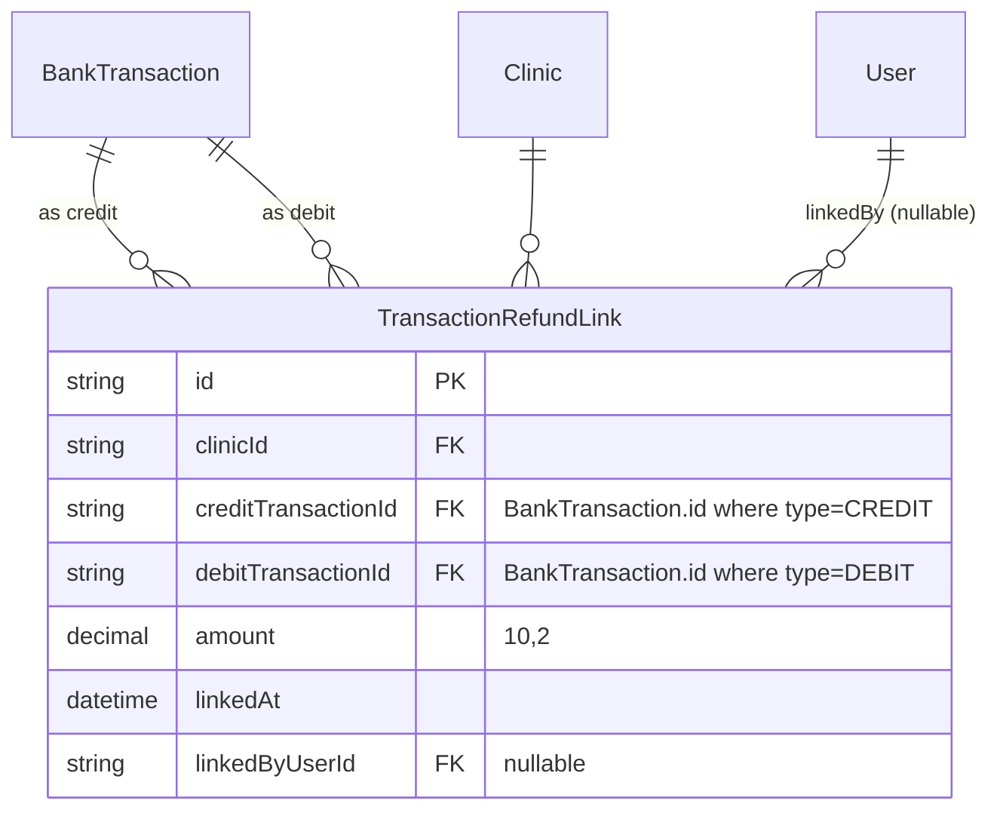

# feat: Refund link — pair overpayment refund debits to their credits

## Overview

When a patient pays more than an invoice's value (e.g. R$ 250 for an
R$ 200 invoice) and the operator refunds the difference (Δ) via PIX,
two bank transactions today sit unresolved in the conciliação queues:
the **credit** with R$ Δ unallocated, and the **outgoing refund debit**
with no expense to attach to. They cancel each other in the books —
the system just doesn't know it.

This feature introduces a new `TransactionRefundLink` junction model
that explicitly pairs the credit and debit. After linking, both
transactions count as fully resolved and disappear from their
respective queues. The audit trail captures the operator, amount, and
timestamp of the call.

The flow is symmetric: the operator can identify the link starting from
the credit (conciliação queue) or from the debit (despesas/inter
queue). Both use the same junction model and the same backend logic.
Suggestion ranking reuses the existing `bank-reconciliation/matcher`
algorithm (payer-name similarity + amount proximity + date proximity).

## Problem Statement

Today's reality:
- A `BankTransaction` is "fully resolved" when the sum of its
  `reconciliationLinks` (credits→invoices) or
  `expenseReconciliationLinks` (debits→expenses) covers the full
  transaction amount, OR when `dismissReason` is set on the whole
  transaction.
- Partial reconciliation is allowed — `current + newAmount ≤ totalAmount + 0.01`
  guards in `/api/financeiro/conciliacao/reconcile/route.ts:84-185`.
- A credit with R$ Δ unallocated stays at the top of the conciliação
  queue indefinitely — there is no notion of "the leftover is
  someone else's money I gave back".
- The matching outgoing PIX is its own `BankTransaction` of `type: "DEBIT"`
  in the despesas/inter queue, with no expense to link to. The
  operator can dismiss it with `TRANSFER`, but that loses the audit
  trail (no link to the original credit).

The MIRELA case prompted this: an R$ Δ refund went out via PIX (debit
exists in the system), and both halves of the operation are stuck.

## Proposed Solution

```
BankTransaction (CREDIT)         TransactionRefundLink         BankTransaction (DEBIT)
   id: cmosypci…                                                 id: cmotxz9b…
   amount: R$ 250                                                amount: R$ 50
   payerName: MIRELA              creditTransactionId ─►◄── debitTransactionId
   reconciliationLinks ──┐         amount: R$ 50                 expenseReconciliationLinks: []
                          │         linkedByUserId
                          ▼
                  ReconciliationLink
                  amount: R$ 200
                  invoiceId ──► Invoice (R$ 200) status: PAGO
```

Resolution math:

```
isFullyResolved(tx) =
  tx.dismissReason !== null
    || (tx.amount - sum(reconciliationLinks.amount) - sum(refundLinksWhereTxIsCredit.amount)) ≤ 0.01    // for CREDIT
    || (tx.amount - sum(expenseReconciliationLinks.amount) - sum(refundLinksWhereTxIsDebit.amount)) ≤ 0.01  // for DEBIT
```

Same junction row resolves both halves — that's the point.

### Endpoint shape

`POST /api/financeiro/conciliacao/refund-links`

```jsonc
{
  "creditTransactionId": "cmosypci…",
  "debitTransactionId": "cmotxz9b…",
  "amount": 50.0
}
```

Server runs in a single Prisma transaction:
1. Fetch both `BankTransaction`s — must exist, both belong to the
   caller's clinic, the credit is `type: CREDIT`, the debit is
   `type: DEBIT`, neither is dismissed.
2. Compute remaining-on-credit (amount − reconciled − already-refunded)
   and remaining-on-debit (amount − expense-linked − already-refunded).
   New `amount` must be ≤ both with the existing 0.01 tolerance.
3. Create the `TransactionRefundLink` row (the `[creditId, debitId]`
   unique constraint handles double-submit idempotency at the DB level
   → return 409 if already exists).
4. Audit `TRANSACTION_REFUND_LINK_CREATED` with both transaction IDs +
   amount.

`DELETE /api/financeiro/conciliacao/refund-links?id={linkId}` — undoes the
link inside a transaction, audits `TRANSACTION_REFUND_LINK_DELETED`.

`GET /api/financeiro/conciliacao/refund-candidates?creditTransactionId={id}`
— returns the suggested debit matches, ranked by similarity score.
Symmetric query with `debitTransactionId={id}` returns suggested
credit matches.

### Why a new junction (not extending an existing one)

Three options were considered (see brainstorm: docs/brainstorms/2026-05-06-refund-link-overpayment-brainstorm.md):
- **A. New junction `TransactionRefundLink` (chosen).** Real-world
  correctness: both transactions track the link; full audit trail.
- **B. Manual "remainder resolved" tag.** Loses the connection to the
  outgoing debit, which still has to be dismissed separately.
- **C. Hybrid (A + B).** Keep B as fallback for cash refunds. Out of
  scope for v1; revisit if it comes up.

A wins because the refund debit already exists as a real
`BankTransaction` — pretending it doesn't (B) just shifts the problem
across the system.

## Technical Approach

### Architecture

ERD for the new model:



Prisma model + relation:

```prisma
// prisma/schema.prisma — new model
model TransactionRefundLink {
  id                  String   @id @default(cuid())
  clinicId            String
  creditTransactionId String
  debitTransactionId  String
  amount              Decimal  @db.Decimal(10, 2)
  linkedAt            DateTime @default(now())
  linkedByUserId      String?

  clinic            Clinic          @relation(fields: [clinicId], references: [id], onDelete: Cascade)
  creditTransaction BankTransaction @relation("RefundLinkCredit", fields: [creditTransactionId], references: [id], onDelete: Cascade)
  debitTransaction  BankTransaction @relation("RefundLinkDebit", fields: [debitTransactionId], references: [id], onDelete: Cascade)
  linkedByUser      User?           @relation(fields: [linkedByUserId], references: [id], onDelete: SetNull)

  @@unique([creditTransactionId, debitTransactionId])
  @@index([clinicId])
  @@index([creditTransactionId])
  @@index([debitTransactionId])
}

// On BankTransaction (existing model) — add the inverse relations
model BankTransaction {
  // … existing fields …
  refundLinksAsCredit TransactionRefundLink[] @relation("RefundLinkCredit")
  refundLinksAsDebit  TransactionRefundLink[] @relation("RefundLinkDebit")
}
```

Migration: standard `CREATE TABLE` + `CREATE INDEX` SQL. No backfill —
existing transactions are unaffected. The shadow-DB tooling issue
(`20260310_add_reconciliation_link` doesn't replay cleanly) means we
write the migration file by hand, same approach as the recent
`add_appointment_notifications_enabled_clinic` migration.

### Implementation Phases

#### Phase 0 — Pre-refactor integration tests *(per saved feedback)*

Before touching any reconciliation code, lock in current behavior:

- `src/app/api/financeiro/conciliacao/reconcile/route.test.ts` (new)
  - POST happy path (single link, multiple links)
  - Over-allocation rejected (>amount + 0.01)
  - Invoice status transitions PENDENTE → PARCIAL → PAGO
  - PatientUsualPayer upsert
  - Cross-clinic isolation (404 on someone else's transaction)
  - DELETE: by linkId, by transactionId, recalculates invoice status
- `src/app/api/financeiro/conciliacao/dismiss/route.test.ts` (new)
  - POST: sets dismissReason / dismissedAt / dismissedByUserId
  - Cannot dismiss already-reconciled transaction
  - Cannot dismiss already-dismissed transaction
  - DELETE: clears dismiss fields
- `src/app/api/financeiro/conciliacao/transactions/route.test.ts` (new)
  - `allocatedAmount` and `remainingAmount` math from
    reconciliationLinks
  - `isFullyReconciled` true when fully covered
  - `showReconciled=true|false` filter

These tests exist to **catch regressions** when Phase 3 modifies the
"resolved" derivation to include refund links.

**Effort:** ~2-3 hours.

#### Phase 1 — Schema + migration

- Add `TransactionRefundLink` to `prisma/schema.prisma`.
- Add inverse relations on `BankTransaction`.
- Add audit actions: `TRANSACTION_REFUND_LINK_CREATED`,
  `TRANSACTION_REFUND_LINK_DELETED` to the AuditAction enum
  (`src/lib/rbac/audit.ts`).
- Hand-write migration file:
  `prisma/migrations/20260506000000_add_transaction_refund_link/migration.sql`
  with `CREATE TABLE` + `CREATE INDEX` + `ADD CONSTRAINT` SQL.
- `npx prisma migrate deploy` locally + regenerate client.

**Effort:** ~30 min.

#### Phase 2 — Service + endpoints

New domain module: `src/lib/bank-reconciliation/refund-links.ts`

```typescript
// Pure functions — testable without Prisma
export function computeRemainingForCredit(
  amount: Decimal,
  reconciledTotal: Decimal,
  refundedTotal: Decimal,
): Decimal { /* tolerance 0.01 */ }

export function computeRemainingForDebit(
  amount: Decimal,
  expenseLinkedTotal: Decimal,
  refundedTotal: Decimal,
): Decimal { /* tolerance 0.01 */ }

export function rankRefundCandidates(
  credit: { amount, payerName, date, remainingAmount },
  candidateDebits: BankTransaction[],
  patientUsualPayers: PatientUsualPayer[],
): RankedCandidate[] {
  // Reuses src/lib/bank-reconciliation/matcher.ts utilities:
  //   normalizeForComparison, nameSimilarity, nameContainedIn
  // Score = w1*nameScore + w2*amountProximity + w3*dateProximity
  // Returns sorted desc, dropping score < 0.1
}
```

Tests for each pure function colocated.

New routes:

- `src/app/api/financeiro/conciliacao/refund-candidates/route.ts`
  ```typescript
  export const GET = withFeatureAuth(
    { feature: "finances", minAccess: "WRITE" },
    async (req, { user }) => {
      const sp = new URL(req.url).searchParams
      const direction = sp.get("direction") ?? "fromCredit"
      const txId = sp.get(direction === "fromCredit"
        ? "creditTransactionId"
        : "debitTransactionId")
      // Fetch source tx (must be in clinic, type matches direction)
      // Fetch candidate txs (opposite type, same clinic, not dismissed,
      //   not already linked to this source, has remaining amount)
      //   Window: ±14 days around source.date
      // Fetch usualPayers for any patients reconciled to the source
      // Rank via rankRefundCandidates
      // Return { candidates: [...], windowDays: 14 }
    },
  )
  ```

- `src/app/api/financeiro/conciliacao/refund-links/route.ts`
  ```typescript
  // POST: create link
  // Validations (in transaction):
  //   - both txs exist + same clinic
  //   - credit.type === "CREDIT", debit.type === "DEBIT"
  //   - neither dismissed
  //   - amount ≤ credit.remaining (with 0.01 tolerance)
  //   - amount ≤ debit.remaining (with 0.01 tolerance)
  //   - amount > 0
  //   - no existing link [credit, debit] (unique constraint catches; return 409)
  // Creates TransactionRefundLink + audit log
  //
  // DELETE: ?id=linkId — finds link in clinic, deletes, audits
  ```

**Effort:** ~3-4 hours including tests.

#### Phase 3 — Update transactions fetch to include refund math

`src/app/api/financeiro/conciliacao/transactions/route.ts` already
computes `allocatedAmount` from `reconciliationLinks`. Extend to include
`refundLinksAsCredit.amount` for credits / `refundLinksAsDebit.amount`
for debits.

Update `Transaction` shape in
`src/app/financeiro/conciliacao/components/types.ts`:

```typescript
interface Transaction {
  // … existing fields …
  reconciledAmount: number     // sum of reconciliationLinks (credit) or expenseReconciliationLinks (debit)
  refundedAmount: number       // sum of refund links on the relevant side
  allocatedAmount: number      // reconciledAmount + refundedAmount
  remainingAmount: number      // amount - allocatedAmount
  isFullyReconciled: boolean   // remainingAmount ≤ 0.01 OR dismissed
  refundLinks: RefundLinkInfo[] // existing links shown in transaction details
}
```

Existing UI consumers stay working: `allocatedAmount` / `remainingAmount`
/ `isFullyReconciled` keep their meaning. Phase 0 tests guard this.

Symmetric update for the debit-transactions endpoint
(`src/app/api/financeiro/conciliacao/debit-transactions/route.ts`).

**Effort:** ~1-2 hours.

#### Phase 4 — Credit-side UI ("Identificar devolução")

In `src/app/financeiro/conciliacao/components/UnmatchedTransactionCard.tsx`
(or whichever component renders a credit row):

- New action button "Identificar devolução" visible when
  `remainingAmount > 0.01 && !isFullyReconciled` (i.e. partial
  allocation + leftover).
- On click, opens `<RefundCandidatePicker>` (new component, <200 lines):
  - Header: source-credit summary + remaining amount
  - List of suggested debits (from refund-candidates API)
  - "Ver outras transações abertas" toggle to expand to all
    unreconciled debits in the window
  - Each row: date, amount, payer, similarity badge, "Selecionar"
  - Selected row → confirmation dialog with editable amount (default = leftover)
  - On confirm → POST refund-links → toast → close picker → refetch transactions
- Existing "Conciliar com fatura" / "Dismiss" buttons unchanged.

**Effort:** ~3-4 hours.

#### Phase 5 — Debit-side UI ("Identificar origem da devolução")

Same pattern in the despesas/inter queue:

- New action on a partially-resolved debit: "Identificar origem da devolução"
- Opens the same `<RefundCandidatePicker>` with `direction="fromDebit"`
- Picker uses `creditTransactionId` candidates instead

**Effort:** ~1-2 hours (mostly reusing the same component).

#### Phase 6 — Build, test, manual smoke

- `npm run build` — clean
- `npm run test` — full pass, including the Phase 0 regression tests
- Manual smoke (local with prod-synced data):
  1. Import a credit + matching debit (or use existing MIRELA-like row
     after restoring local DB)
  2. Reconcile credit's R$ X − Δ to an invoice
  3. Click "Identificar devolução" on the credit
  4. Confirm the suggestion ranking surfaces the matching debit at the top
  5. Confirm both transactions disappear from their queues
  6. Open transaction detail → confirm refund link is shown
  7. Delete the refund link → both transactions reappear
- Mark plan completed.

**Effort:** ~1 hour.

**Total estimated effort:** ~12 hours of focused work.

## Alternative Approaches Considered

(Carried from brainstorm: docs/brainstorms/2026-05-06-refund-link-overpayment-brainstorm.md)

- **B. Manual "remainder resolved" tag** with free-text note. Rejected:
  loses the link to the actual debit, which still appears unreconciled.
- **C. Hybrid A + B.** Worth keeping in mind for cash refunds (no
  matching debit in the system). Out of scope for this plan; revisit
  with `MANUAL_REFUND` enum value if it comes up.

## System-Wide Impact

### Interaction Graph

`Operator clicks "Identificar devolução"` →
`<RefundCandidatePicker>` mounts → `GET /refund-candidates?creditTransactionId=…` →
fetch candidate debits + patient usual payers → rank via
`rankRefundCandidates` → render list →
operator selects a debit + confirms amount →
`POST /refund-links` → server validates (clinic, types, dismiss, amounts) →
creates `TransactionRefundLink` in transaction → `audit.log` →
client refetches `/transactions` → both transactions show
`isFullyReconciled: true` → both disappear from their queues.

No middleware, callbacks, or observers fire on the Prisma side. The
audit log call is fire-and-forget (catches errors so a failure to
audit doesn't fail the link creation).

### Error & Failure Propagation

| Layer | Error | Handled where | User sees |
|-------|-------|---------------|-----------|
| zod / route validation | missing fields | route returns 400 | Toast + client-side hint |
| both txs not found / wrong clinic | server check | route returns 404 | Toast: "Transação não encontrada" |
| credit isn't CREDIT / debit isn't DEBIT | server check | route returns 400 | Toast: "Tipos de transação inválidos" |
| transaction dismissed | server check | route returns 400 | Toast: "Transação dispensada — desfaça antes" |
| amount > remaining | server check | route returns 400 with leftover | Toast: "Valor excede o restante" |
| existing link | DB unique constraint (P2002) | catch + return 409 | Toast: "Devolução já registrada" |
| concurrent create | one wins; the other hits unique constraint | same as above | Toast |
| audit log fails | swallowed via `.catch()` | logs to console.warn | Link still created |

### State Lifecycle Risks

1. **Operator deletes a `ReconciliationLink` (credit→invoice) AFTER
   creating a refund link.** The credit's reconciled total drops; the
   refund link amount may now exceed the new leftover. **Mitigation:**
   inside the existing reconcile DELETE handler, after re-computing,
   verify no refund link's amount now exceeds the remaining; if so,
   return 409 ("undo the refund link first") with the link IDs.
2. **Operator dismisses a transaction with refund links.** Existing
   dismiss endpoint already blocks dismissal of any transaction with
   reconciliation links (line 41-46 of dismiss/route.ts); add the
   same check for refund links.
3. **Cross-clinic FK violation.** The two transactions could in theory
   belong to different clinics. **Mitigation:** the create-link
   endpoint fetches both inside `findFirst` filtered by
   `clinicId: user.clinicId`. Server-side enforcement; FK alone isn't
   enough.
4. **Decimal precision drift.** All amounts are `Decimal(10,2)`.
   Comparisons use the same 0.01 tolerance the existing reconcile
   route uses (`reconciliation.test.ts` covers boundary cases). Use
   `Prisma.Decimal` throughout the service module rather than `number`.

### API Surface Parity

- `POST /api/financeiro/conciliacao/reconcile` — credit↔invoice (existing)
- `POST /api/financeiro/conciliacao/match-expense` — debit↔expense (existing)
- **`POST /api/financeiro/conciliacao/refund-links` — credit↔debit (this plan)**
- `POST /api/financeiro/conciliacao/dismiss` — whole-transaction (existing, **gated** by this plan to also block when refund links exist)

`/transactions` and `/debit-transactions` fetch endpoints both gain
`refundedAmount` / `refundLinks[]` fields.

### Integration Test Scenarios

1. **Round trip.** Reconcile credit's R$ 200 to invoice; create refund
   link for R$ 50 to a debit; both transactions show
   `isFullyReconciled: true`; delete the refund link; both reappear in
   the queues with the right `remainingAmount`.
2. **Cross-clinic isolation.** Operator in clinic A passes a debit
   from clinic B. Endpoint must return 404 (the source-tx
   `findFirst({ where: { id, clinicId } })` blocks it).
3. **Concurrent create.** Two browsers POST simultaneously with the
   same `(credit, debit)` pair. One wins; the other hits the unique
   constraint and gets 409 "Devolução já registrada".
4. **Reconciliation rollback after refund link.** Operator creates
   refund link R$ 50 on credit reconciled to R$ 200 (R$ 250 total).
   Then operator tries to delete the credit→invoice link. Must return
   409 with a clear pointer at the conflicting refund link.
5. **Dismiss blocked.** Transaction has a refund link → POST dismiss
   returns 400 ("undo the refund link first").

## Acceptance Criteria

### Functional Requirements

- [ ] `prisma/schema.prisma` declares `TransactionRefundLink` with the
      shape above; inverse relations added to `BankTransaction`
- [ ] Migration file at
      `prisma/migrations/20260506000000_add_transaction_refund_link/migration.sql`
      applies cleanly (`prisma migrate deploy` succeeds locally; Vercel
      build runs it on next deploy)
- [ ] `POST /api/financeiro/conciliacao/refund-links` validates types,
      clinic scope, dismiss state, and amount caps; creates link in a
      transaction; audits `TRANSACTION_REFUND_LINK_CREATED`
- [ ] `DELETE` on the same path undoes the link and audits
      `TRANSACTION_REFUND_LINK_DELETED`
- [ ] `GET /api/financeiro/conciliacao/refund-candidates` returns
      ranked candidates sorted by score; respects clinic scope; filters
      dismissed and already-linked candidates; honors a ±14-day window
- [ ] `/transactions` and `/debit-transactions` endpoints surface
      `refundedAmount`, updated `allocatedAmount`/`remainingAmount`/
      `isFullyReconciled`, and existing `refundLinks` array
- [ ] Existing reconcile DELETE refuses to remove a link if doing so
      would violate any refund link's amount; returns 409 with the
      conflicting refund link IDs
- [ ] Existing dismiss POST refuses to dismiss a transaction that has
      refund links
- [ ] Conciliação credit-side UI shows "Identificar devolução" only
      when `remainingAmount > 0.01 && !dismissed && !isFullyReconciled`
- [ ] `<RefundCandidatePicker>` lists ranked suggestions, allows
      manual selection of any open opposite-type transaction in the
      window, and lets the operator edit the amount before confirming
- [ ] Despesas/inter UI mirrors the affordance for partially-resolved
      debits ("Identificar origem da devolução")
- [ ] Both transactions disappear from their queues after a successful
      link

### Non-Functional Requirements

- [ ] All new files <200 lines (CLAUDE.md size rule)
- [ ] Multi-tenant `clinicId` scoping enforced at every Prisma query
      (cross-tenant test in Phase 0)
- [ ] No raw `useEffect` for state sync; use `useMountEffect` /
      `useDebouncedValue` where one-time setup or input debouncing is needed
- [ ] Migration written by hand and applied with `migrate deploy` (the
      shadow-DB issue blocks `migrate dev`)
- [ ] Decimal arithmetic uses `Prisma.Decimal` throughout the service
      module; tolerance constant matches existing 0.01 used by
      reconcile route
- [ ] No regression in current reconciliation / dismiss / transaction
      fetch behavior (Phase 0 tests guard this)

### Quality Gates

- [ ] Phase 0 integration tests for existing reconcile + dismiss +
      transactions endpoints land **before** Phase 3 modifies the
      "resolved" derivation
- [ ] `npm run build` passes
- [ ] `npm run test` passes (existing + ~30 new tests)
- [ ] Manual smoke confirms the round-trip works end-to-end on a
      prod-synced local DB

## Success Metrics

- The MIRELA-like case can be resolved end-to-end in <30s without
  shell tools or DB editing.
- Zero "stuck transaction" reports related to overpayment refunds
  after rollout.
- Both queues' "open" counts go down by the count of historical
  refund-pair leftovers once operators run through the backlog.

## Dependencies & Risks

- **Dependency: existing matcher infrastructure** in
  `src/lib/bank-reconciliation/matcher.ts` is reused for ranking. If
  that module is refactored mid-plan, watch for divergence.
- **Risk: silent invoice-status drift after refund-link delete.**
  Refund link deletion doesn't touch invoice status — only
  reconciliation-link deletion does. Phase 0 tests confirm this stays
  true; Phase 2 service code intentionally avoids invoice-status
  recomputation in the refund-link path.
- **Risk: matcher score weights tuned for credit→invoice may not be
  ideal for credit→debit.** The signals are similar (payer name,
  amount, date) but the population differs (debits are smaller, may
  have generic descriptions). Default to existing weights; revisit if
  ranking quality is poor in practice.
- **Risk: shadow-DB still broken.** Mitigated by the same hand-written
  migration approach used in the recent
  `add_appointment_notifications_enabled_clinic` migration. Document
  in commit message so the next contributor knows the workaround.
- **Out of scope:** cash refunds (no matching debit), refund of a
  refund (chained), multi-currency.

## Open Questions

- **Suggestion window default.** ±14 days fits the brainstorm. Should
  this be configurable per clinic? Probably no — keep simple, can
  expose later.
- **Auto-learn payer aliases on refund?** When operator confirms a
  refund link and the debit's payerName matches a patient (via the
  source credit's reconciled invoices), should we
  `PatientUsualPayer.upsert` for that name? Probably yes for
  consistency with the reconcile flow; minimal extra code.
- **`MANUAL_REFUND` dismiss reason.** Add now (cheap) so the cash-refund
  path B has a clean home, even if we don't build the UI yet?
  Recommend yes — it's a one-line enum change.
- **UI copy.** "Identificar devolução" on credit, "Identificar origem
  da devolução" on debit. Confirm with the user during build; easy to
  swap.

## Sources & References

### Origin

- **Brainstorm:** [docs/brainstorms/2026-05-06-refund-link-overpayment-brainstorm.md](../brainstorms/2026-05-06-refund-link-overpayment-brainstorm.md)

  Key decisions carried forward:
  1. Approach A — junction model `TransactionRefundLink` (over manual
     tag or hybrid)
  2. Resolution math counts refund-link amounts on both sides
  3. Symmetric flow from both credit and debit queues
  4. Suggestion ranking on payer name + amount + date proximity
  5. Invoice not affected; only the bank-side books balance
  6. "Devolução" as canonical term

### Internal References

- **Schema precedent — ReconciliationLink:**
  `prisma/schema.prisma:1171-1188`
- **Schema precedent — ExpenseReconciliationLink:**
  `prisma/schema.prisma:1330-1347`
- **BankTransaction model:** `prisma/schema.prisma:1143-1168`
- **TransactionDismissReason enum:** `prisma/schema.prisma:1135-1140`
- **Existing reconcile API (template):**
  `src/app/api/financeiro/conciliacao/reconcile/route.ts:28-291`
- **Existing dismiss API (template):**
  `src/app/api/financeiro/conciliacao/dismiss/route.ts`
- **Transactions fetch (where to add refund math):**
  `src/app/api/financeiro/conciliacao/transactions/route.ts:36-90+`
- **Match-expense API (debit-side template):**
  `src/app/api/financeiro/conciliacao/match-expense/route.ts`
- **Matcher utilities to reuse:**
  `src/lib/bank-reconciliation/matcher.ts:19-128`
- **Conciliação UI types:**
  `src/app/financeiro/conciliacao/components/types.ts`
- **PatientUsualPayer model + upsert pattern:**
  `prisma/schema.prisma:492-504`,
  `src/app/api/financeiro/conciliacao/reconcile/route.ts:170-184`
- **Audit module:** `src/lib/rbac/audit.ts`
- **Migration approach precedent (manual file due to shadow-DB issue):**
  `prisma/migrations/20260505000000_add_appointment_notifications_enabled_clinic/`

### CLAUDE.md Rules in Force

- **Tests required** for every new feature/refactor
- **No raw `useEffect`** for state sync; use `useMountEffect`
- **Files <200 lines** per file
- **Brazilian Portuguese** UI copy (and error messages)
- **No `prisma db push`** — hand-write migrations
- **Multi-tenant `clinicId` scoping** at the query level
- **DDD: domain logic in `src/lib/`** (refund-link service module
  lives there)

### Related Work

- **Pending intake alert** + **intake approve-with-edit** plans
  shipped earlier today (commits `cbc10e7`–`ba48cb5`); the
  reconciliation feature complements the same fiscal flow (post-paid
  invoices that arrive via bank).
- **AP/AR cash flow feature** (memory) — built the
  ExpenseReconciliationLink model and the despesas/inter queue this
  plan extends.
